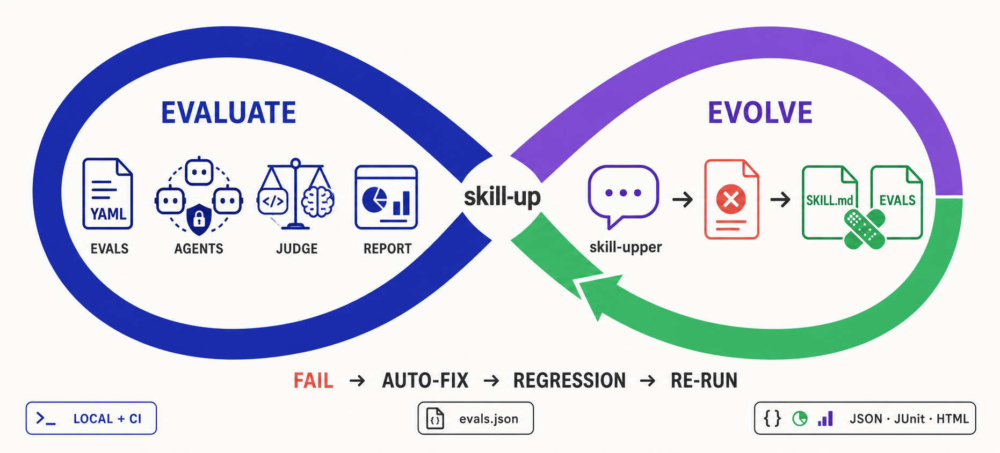

<div align="center">
  <p align="center">
    
  </p>

  <h1>skill-up</h1>

  <p align="center">
    <b>评测 Agent Skill、Agent 与 Workspace，基于证据演进 Skill。</b>
  </p>

  <p align="center">
    <a href="https://github.com/alibaba/skill-up/actions">
      
    </a>
    <a href="https://deepwiki.com/alibaba/skill-up">
      
    </a>
    <a href="./.github/badges/coverage.json">
      
    </a>
    <a href="https://go.dev/">
      
    </a>
    <a href="LICENSE">
      
    </a>
    <a href="https://goreportcard.com/report/github.com/alibaba/skill-up">
      
    </a>
    <a href="https://github.com/alibaba/skill-up/releases">
      
    </a>
    <a href="plugins/dsh-skill-up/README.md">
      
    </a>
  </p>

  <p align="center">
    <a href="./README.md">English</a> | <b>中文</b>
  </p>

  <p align="center">
    📖 <a href="https://alibaba.github.io/skill-up/zh/">用户手册</a> · <a href="https://alibaba.github.io/skill-up/">User Manual</a>
  </p>

  <hr />
</div>

## 简介

**skill-up** 是评测 Agent Skill、Agent 及其 Workspace 的 CLI。它用声明式用例驱动 Agent Engine，检查响应和 Workspace 变更，并在本地或 CI 生成报告。

- **Skill 评测**：验证 Skill 在不同用例中的行为，并可对比安装与不安装 Skill 的结果。
- **Agent 评测**：不安装 Skill，直接评估内置或自定义 Agent 的表现。
- **Workspace 评测**：使用用例 fixture 或已有本地目录，检查 Agent 对文件和代码仓库的处理结果。
- **Skill 演进**：**skill-upper** 通过对话分析失败、修复或补充评测用例，并重新运行 skill-up。



## 特性

- **skill-upper 从评测到演进的闭环**：通过自然对话创建评测、诊断失败、自动修复或补充用例并重新运行 skill-up，让 eval 评测集持续演进。
- **声明式评测配置**：通过 YAML（`eval.yaml` + `cases/*.yaml`）定义评测环境、引擎、模型和用例。
- **运行环境准备**：为每个用例准备本地、Docker 或 OpenSandbox 环境，在支持的 Agent Engine 中安装配置的真实或 Mock MCP Server，并将 `context.repo_fixture` 和 `context.files` 上传到 workspace。
- **可选 Skill 与 Workspace 用例**：无需安装 Skill 即可评测 Agent；可按用例准备代码仓库 fixture，或用 `--workspace` 评测已有本地目录。
- **多引擎支持**：内置支持 Qoder CLI、Claude Code、Codex；亦可通过 `engine.custom` 接入用户自定义 Agent（本地传输，详见 [docs/design/custom-engine.md](docs/design/custom-engine.md)）。
- **DeepSeek Harness 插件**：通过内置的 `skill-upper` Skill、显式启用的持久化观察采集、审批门禁回归用例、隔离运行与状态对比，验证有证据的 Skill 改进。详见 [`plugins/dsh-skill-up`](plugins/dsh-skill-up/README.md)。
- **灵活评分**：支持 `rule_based`（规则匹配）、`script`（脚本评分）、`agent_judge`（Agent 评分）三种评估策略。
- **结构化报告**：输出 Anthropic 兼容的 `grading.json`、`benchmark.json`、`benchmark.md`，以及 `result.json`、JUnit XML 和 HTML 报告。
- **Anthropic 兼容**：通过 `skill-up import` 导入 `evals.json`，或使用 `--auto` 自动识别。
- **CI 就绪**：专为本地开发和持续集成流水线设计。

## 为什么需要 skill-up

[Harness engineering](https://openai.com/index/harness-engineering/) 将 Agent 的运行环境、工具、约束和反馈循环都视为需要设计与改进的系统部分；[行为评测](https://developers.googleblog.com/the-anatomy-of-harness-engineering-how-to-evaluate-iterate-and-guard-ai-coding-agents/) 则让预期动作可观察，并帮助发现回归。`skill-up` 提供其中的评测与反馈环节：用可复现的提示词和 Workspace 运行 Agent，检查响应、工具调用和文件变更，并生成结构化报告。

评测 Skill 时，官方的 [Agent Skills 评测指南](https://agentskills.io/skill-creation/evaluating-skills) 还强调安装与不安装 Skill 的对比、评分汇总和持续迭代。`skill-up` 用同一套 CLI 支持这些流程：

- 用声明式的 `eval.yaml` + `cases/*.yaml` 取代临时拼出来的运行目录。
- 补齐持续改进闭环：skill-upper 可以解读失败报告、修复或新增 eval 用例，并通过对话驱动下一轮 skill-up 运行。
- 自动完成 Workspace 准备、按需安装 Skill、调用 Agent Engine、评分和生成报告。
- 支持多个引擎（`claude_code`、`codex`、`qodercli`、`qwen_code`），不绑定单一客户端。
- 兼容 Anthropic 风格的 `evals.json`，同时提供更丰富的 judge、适合 CI 的命令和结构化报告。

## 快速上手：使用 skill-upper 演进 Skill

演进 Skill 时，可使用仓库内置的 **skill-upper** Agent Skill。它可以让
AI Agent 通过对话创建评测、运行 skill-up、理解失败原因、修复 Skill 或
eval、补充回归用例，并持续完成下一轮迭代。

参与仓库开发时，只修改 `skills/skill-upper/` 这一份唯一源码。插件 bundle
生成到被忽略的构建目录中，不跟踪副本，也不使用软链；本地打包前运行
`make bundle-plugins`。
`make package-plugins VERSION=<version>` 会生成自包含的 Codex 和 DSH
安装包。GitHub tag release 会同时附带两个安装包及其校验和；本仓库不会将
任一插件发布到外部 marketplace 或 npm。

### 第一步：安装 skill-upper

```bash
# Codex，全局安装
npx skills add https://github.com/alibaba/skill-up/tree/main/skills/skill-upper -g -a codex -y

# Claude Code，全局安装
npx skills add https://github.com/alibaba/skill-up/tree/main/skills/skill-upper -g -a claude-code -y
```

通常不需要提前安装 skill-up。skill-upper 运行时会检查 CLI；如果缺失，
它会引导 Agent 完成安装。

### 第二步：创建并运行第一组评测

在 Codex、Claude Code 或其他兼容 Agent 中打开包含 `SKILL.md` 的 Skill
项目，然后直接对话：

```markdown
使用 skill-upper 评测这个 Skill。
阅读 SKILL.md，识别最重要的能力，创建真实的 eval 用例并选择合适的
Judge，校验配置后运行 skill-up。最后总结结果和影响最大的失败项。
```

skill-upper 会生成声明式评测集并替你驱动 CLI：

```text
my-skill/
  SKILL.md
  evals/
    eval.yaml
    cases/
      <case-id>.yaml
my-skill-workspace/
  iteration-1/
    result.json
```

### 第三步：修复、回归并持续迭代

在同一段对话中继续：

```markdown
检查最新的 skill-up 评测结果。逐个判断失败来自 Skill 还是 eval：
按需修复 SKILL.md 和相关文件，或修复 eval 用例与 Judge；为发现的问题
补充回归用例，然后重新运行 skill-up，直到关键能力通过评测。
```

这就是演进闭环：报告转化为修复，修复沉淀为回归用例，每轮迭代都会让
Skill 和它的评测集更可靠。

### 更喜欢手工配置？

你仍然可以直接安装 CLI，并手写 `eval.yaml` 与用例文件：

```bash
curl -fsSL https://raw.githubusercontent.com/alibaba/skill-up/main/install.sh | bash
```

详细步骤请查看官网的
[快速开始](https://alibaba.github.io/skill-up/zh/guide/getting-started)、
[编写评测](https://alibaba.github.io/skill-up/zh/guide/writing-evals)、
[CLI 命令参考](https://alibaba.github.io/skill-up/zh/guide/cli-reference)和
[用户配置](https://alibaba.github.io/skill-up/zh/guide/user-config)。
Windows 的安装方式与已知限制请参阅
[Windows 指南](https://alibaba.github.io/skill-up/zh/guide/windows)。

## 不依赖 Skill 评测 Agent 或 Workspace

Agent 评测集不需要 `SKILL.md`，但应显式设置 `skills: []`：省略 `skills` 时，
如果 skill-up 在配置文件的上层目录找到 `SKILL.md`，就会自动安装该 Skill。
将 `eval.yaml` 和用例放在 `evals/` 下，并显式传入配置路径。用例和 fixture
路径相对于找到的 Skill 根目录解析；找不到时则相对于 `evals/` 所在目录。

```yaml
# evals/eval.yaml
schema_version: v1alpha1
environment:
  type: none
skills: []
engine:
  name: codex
cases:
  files:
    - evals/cases/agent-response.yaml
```

```yaml
# evals/cases/agent-response.yaml
input:
  prompt: Reply with READY.
expect:
  must_contain: [READY]
```

```bash
skill-up validate ./evals/eval.yaml
skill-up run ./evals/eval.yaml
```

评测代码仓库任务时，可在用例中用 `context.repo_fixture` 准备独立的
Workspace，再通过 `expect` 或 Judge 检查结果。评测已准备好的本地目录时，
先编写适用于该目录的用例，再运行
`skill-up run ./evals/eval.yaml --workspace /path/to/project --parallelism 1`。
skill-up 会保留这个目录，但 Agent 和用例准备步骤可能修改其中内容。此参数仅
支持 `environment.type: none`、串行用例且关闭 benchmark。详见
[编写评测](docs/zh/guide/writing-evals.md)和
[CLI 命令参考](docs/zh/guide/cli-reference.md#skill-up-run)。

## CLI 命令概览

| 命令                                 | 说明                                       |
| ------------------------------------ | ------------------------------------------ |
| `skill-up run [path]`                | 运行评测用例并生成报告                     |
| `skill-up validate [path]`           | 校验 `eval.yaml`、用例文件与 skill 完整性  |
| `skill-up list-cases [path]`         | 列出配置引用的所有用例                     |
| `skill-up report <result.json>`      | 从已有结果生成报告                         |
| `skill-up import <evals.json>`       | 将 Anthropic `evals.json` 导入为 YAML 用例 |
| `skill-up debug judge <input.json>`  | 使用 JSON 输入调试 judge 模块              |
| `skill-up debug report <input.json>` | 使用 JSON 输入调试 report 模块             |

## GitHub Action

在 CI 上对你的 Agent Skill 跑评测,每个 PR 自动触发——并在一步内**跨引擎**
(`claude_code` / `codex` / `qodercli` / `qwen_code`)校验同一个 skill。本仓库根目录提供了
action([`action.yml`](action.yml)):

```yaml
# .github/workflows/skill-eval.yml
name: Skill Eval
on:
  pull_request:
    paths: ['skills/**', 'evals/**', '**/SKILL.md']
jobs:
  eval:
    runs-on: ubuntu-latest          # Docker 容器 action —— 仅 Linux
    steps:
      - uses: actions/checkout@v4
      - uses: alibaba/skill-up@main  # 见下方「版本引用」
        with:
          engine: claude_code        # 或 codex / qodercli / qwen_code;留空则由 eval.yaml 自行声明
          api-key: ${{ secrets.ANTHROPIC_API_KEY }}
          base-url: https://api.anthropic.com   # 你的模型端点
          skill-target: evals/eval.yaml
```

调用方前提:**Linux** runner(这是 Docker 容器 action),以及把模型凭据存为仓库
secret。runner 镜像是 public 的,无需额外 registry 鉴权。

主要入参:`engine`、`model`、`provider`、`api-key`、`base-url`、`skill-target`、
`parallelism`。action 预先把 skill-up 和三个引擎 CLI 烤进 runner 镜像,跑一次
就是「拉镜像、评测」。完整入参/产出见 [`action.yml`](action.yml)。

### 版本引用

`uses:` 可以指向任何**包含 `action.yml`** 的 git ref。生产建议 pin 一个**含本
action 的 release tag**(从引入 action 的那个 release 起)或 commit SHA;`@main`
则始终跟随最新。**早于** action 引入的 release tag 里没有 `action.yml`,不能用作 ref。

## 许可证

Apache License 2.0 — 详见 [LICENSE](LICENSE)。
