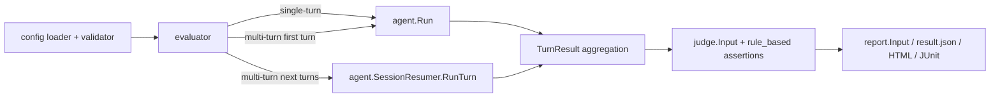

# Multi-Turn Conversation Evaluation Implementation Plan

Status: draft for review
Source proposal: SUP-0001 Multi-Turn Conversation Evaluation Support
Last reviewed: 2026-07-03

## Objective

Implement deterministic, scripted multi-turn conversation evaluation in
skill-up. A case using `input.turns` must execute turn by turn, preserve one
agent session across turns, evaluate intermediate `post_condition` checks,
capture values for later prompts, expose per-turn results to judges and
reports, and keep existing `input.prompt` cases behavior-compatible.

The implementation should keep module ownership clear:

- `internal/config`: schema and validation only.
- `internal/agent`: agent execution and session-resume adapters only.
- `internal/evaluator`: turn orchestration, runtime lifecycle, aggregation.
- `internal/judge`: assertions over already-collected facts.
- `internal/report` and `internal/runner`: serialization and presentation of
  evaluation facts.

## Current State

The repository already contains important foundations:

- `internal/config.Input` already has `Prompt` and `Turns`.
- `internal/config.Turn` already has `Role`, `Content`, and `PostCondition`.
- `pkg/transcript.Message` already carries `Turn`.
- `internal/agent.Agent.Run` already accepts `[]transcript.Message`.
- `agent.SessionResult` already carries transcript, tokens, final message, and
  artifacts.
- Custom engines already receive a structured `SessionInput.messages` contract.

The missing core is that evaluator execution still sends all turns to one
`agent.Run` call. Built-in CLI agents then collapse those messages through
`BuildInstructionFromMessages`, so there is no real turn-by-turn interaction,
no intermediate condition checking, and no per-turn judge input.

## Architecture



Multi-turn execution will be a new branch inside the existing case lifecycle,
after runtime preparation and before the current single-call `agent.Run`. The
single-turn path remains the existing path.

Key data flow:

1. Validator accepts only well-formed `input.turns`, post conditions, capture
   rules, and per-turn judge rules.
2. Evaluator starts a case runtime exactly once.
3. Turn 1 calls `Agent.Run` to create a real agent session.
4. Later turns call `SessionResumer.RunTurn` with the extracted session ID.
5. Each turn produces an evaluator-owned `TurnResult`.
6. Evaluator aggregates final `SessionResult`, transcript, status, and judge
   input.
7. Judge evaluates global and per-turn assertions without knowing agent details.
8. Runner/report serialize turn results as part of the existing result model.

## Module Plan

### 1. Config Schema

Files:

- `internal/config/schema.go`
- `internal/config/validator.go`
- `internal/config/schema_test.go`
- `internal/config/validator_test.go`
- `internal/config/defaults.yaml` if examples/default docs need updates

Add schema fields:

- `Turn.Capture []CaptureRule`
- `Turn.TimeoutSeconds int`
- `PostCondition.MustContainAll []string`
- `PostCondition.MustNotContain []string`
- `CaptureRule.Variable string`
- `CaptureRule.Pattern string`
- `CaptureRule.JSONPath string`
- `Rule.TurnResponseContains *TurnResponseContainsRule`
- `Rule.TurnResponseNotContains *TurnResponseNotContainsRule`
- `Rule.ToolCalledInTurn *ToolCalledInTurnRule`
- `Rule.ToolNotCalledInTurn *ToolNotCalledInTurnRule`

Validation rules:

- A case must use exactly one meaningful input mode:
  `input.prompt` or `input.turns`. If both are present, return a validation
  error to avoid ambiguous execution.
- `input.turns[*].role` must be `user` for this phase. Other roles are not
  needed for scripted user turns and make resume semantics ambiguous.
- `input.turns[*].content` must not be empty.
- `post_condition.on_fail` must be empty, `fail`, or `skip_remaining`; empty
  means `fail`.
- A post condition must include at least one of `must_contain_any`,
  `must_contain_all`, or `must_not_contain`.
- `capture[*].variable` must match a conservative identifier pattern such as
  `^[A-Za-z_][A-Za-z0-9_]*$`.
- Each capture rule must specify exactly one extractor: `pattern` or
  `jsonpath`.
- Regex patterns must compile during validation.
- `timeout_seconds` must be non-negative.
- Per-turn judge rules must reference turn numbers >= 1 and, when total turns
  are known, <= `len(input.turns)`.
- `turn_response_contains` must specify `contains_all` or `contains_any`.
- `turn_response_not_contains.not_contains` is required.
- `tool_called_in_turn.name` and `tool_not_called_in_turn.name` are required.

Design constraint: validation must not know about agent implementations or
runtime behavior.

### 2. Agent Resume Boundary

Files:

- `internal/agent/agent.go`
- `internal/agent/claude_code.go`
- `internal/agent/qodercli.go`
- `internal/agent/codex.go`
- `internal/agent/*_test.go`

Add a small optional interface without changing `Agent`:

```go
type SessionResumer interface {
    RunTurn(ctx context.Context, rt Runtime, opts ExecOptions, message transcript.Message, sessionID string) (*SessionResult, error)
}
```

Add `SessionResult.SessionID string` so evaluator can resume without
type-specific parsing.

Responsibilities:

- Agent adapters know how to start/resume their own CLI sessions.
- Agent adapters normalize session IDs into `SessionResult.SessionID`.
- Evaluator only checks `SessionResumer` and passes the ID forward.

Implementation order:

1. `claude_code`: first turn already generates a UUID and passes
   `--session-id`. Populate `SessionResult.SessionID` from that generated ID
   even when output parsing does not return it. Add `RunTurn` using
   `claude --resume <session-id> -p`.
2. `qodercli`: switch or add a JSON-output path that can parse `sessionId`.
   Add `RunTurn` using exact `-r <session-id>` rather than "continue latest".
3. `codex`: implement only after safe session correlation is solved. Prefer a
   CLI-emitted session ID. If unavailable, use a case-isolated session
   directory or a locked before/after diff of the session directory. Do not use
   global "latest session" lookup under concurrent `cases.parallelism`.
4. `custom`: no immediate `SessionResumer`. Custom engines already accept full
   message history in one request, so they remain fallback-capable until a
   future custom resume contract is designed.

Boundary cases:

- Empty `sessionID` after turn 1 with more turns remaining becomes a clear case
  execution error.
- Resume command auth/rate-limit handling should reuse existing first-run
  signal detection.
- `ExecOptions.ArtifactDir`, timeout, env, model, workspace, and observability
  metadata must be honored consistently for first and resumed turns.

### 3. Evaluator Multi-Turn Engine

Files:

- `internal/evaluator/evaluator.go`
- likely new focused helper file, for example `internal/evaluator/multiturn.go`
- `internal/evaluator/evaluator_test.go`

Add evaluator-owned types:

```go
type TurnStatus string

const (
    TurnCompleted TurnStatus = "completed"
    TurnSkipped   TurnStatus = "skipped"
    TurnFailed    TurnStatus = "failed"
    TurnError     TurnStatus = "error"
)

type TurnResult struct {
    TurnNumber    int
    Content       string
    Response      string
    Transcript    transcript.Transcript
    SessionResult *agent.SessionResult
    Status        TurnStatus
    Reason        string
    CapturedVars  map[string]string
}
```

Execution behavior:

- Branch to multi-turn only when `len(input.turns) > 1`.
- Keep existing single-turn path untouched for `input.prompt` and one-turn
  `input.turns`.
- Prepare runtime, skills, MCP, workspace diff hooks, artifact dirs, and judge
  config once per case, then execute all turns in that same runtime.
- Turn 1 calls `runAgent.Run` with a single user message.
- Turns 2..N call `resumer.RunTurn`.
- Each turn may have a narrower `turn.timeout_seconds`; the overall case
  timeout still bounds the whole case.
- After each turn, evaluate `post_condition`.
- If `post_condition` fails with `on_fail: fail`, mark the case `FAIL` and do
  not execute later turns.
- If it fails with `on_fail: skip_remaining`, mark remaining turns skipped and
  return a `SKIP` only when the scenario produced no judgeable completed path.
  If there are completed turns plus skipped later turns, judge should still run
  when configured and per-turn rules decide the final status.
- Capture variables after a successful post condition.
- Template substitution happens immediately before sending a turn. Unresolved
  `{{variable}}` placeholders are `ERROR`, not raw prompt text sent to the
  agent.

Result aggregation:

- Preserve every user turn and assistant response in the final transcript with
  correct turn numbers.
- Prefer per-turn transcripts from adapters; when an adapter returns a
  cumulative transcript, normalize/deduplicate before appending.
- Final message is the last completed turn response.
- `Turns` is the number of completed agent turns.
- Token counts sum across turns when adapters return per-turn usage.
- Artifact handling must still run for errors/timeouts, matching current
  single-turn behavior.
- `Expect` and existing global judge rules evaluate against the final aggregate
  session.
- Per-turn judge rules receive `judge.Input.TurnResults`.

Avoid recursion trap: fallback must not call `executeCaseOnce` in a way that
re-enters the multi-turn branch forever. Implement fallback through a dedicated
single-shot helper or a boolean execution mode guard.

### 4. Post Conditions and Capture

Files:

- `internal/evaluator/multiturn.go`
- `internal/evaluator/multiturn_test.go`

Post-condition semantics:

- `must_contain_all`: all required strings must appear.
- `must_contain_any`: at least one string must appear.
- `must_not_contain`: none may appear.
- Matching should initially follow existing `output_contains` behavior:
  case-sensitive by default. If case-insensitive behavior is desired, make it
  explicit in a later schema extension rather than silently diverging.
- Empty `on_fail` means `fail`.
- Failure reason must name the missing or forbidden keyword for debugability.

Capture semantics:

- Regex capture supports named group `(?P<value>...)`; if absent, allow exactly
  one capture group as a convenience.
- No match, invalid group, or empty value is an execution `ERROR`.
- JSONPath capture is phase 3. Keep phase 1/2 regex-only if avoiding a new
  dependency is important.
- Captured values are stored in an evaluator-local map scoped to one case
  execution only.
- Variables are never shared across cases, baseline variants, retries, or
  iterations.
- If a later turn references an unknown variable, fail before invoking the
  agent.

### 5. Judge Per-Turn Assertions

Files:

- `internal/judge/judge.go`
- `internal/judge/rule_based.go`
- `internal/judge/rule_based_test.go`

Add judge-visible turn result:

```go
type TurnResult struct {
    TurnNumber int                   `json:"turn_number"`
    Content    string                `json:"content"`
    Response   string                `json:"response"`
    Transcript transcript.Transcript `json:"transcript"`
    Status     string                `json:"status"`
    Reason     string                `json:"reason,omitempty"`
}
```

Add `TurnResults []TurnResult` to `judge.Input`.

Rules:

- `turn_response_contains`: check one completed turn response with
  `contains_all` and/or `contains_any`.
- `turn_response_not_contains`: check forbidden strings are absent from one
  completed turn response.
- `tool_called_in_turn`: check tool calls in that turn transcript, with the same
  partial argument matching semantics as `tool_called`.
- `tool_not_called_in_turn`: check absence in that turn transcript.

Failure behavior:

- Missing turn is a failing assertion for positive checks.
- Missing turn should also fail for `tool_not_called_in_turn` in this
  implementation, because validation should already reject impossible turn
  numbers and a missing executed turn usually means the scenario did not run as
  expected.
- A skipped, failed, or errored turn is not "completed"; response assertions
  against it fail with evidence naming the status.

### 6. Reporting and Artifacts

Files:

- `internal/report/reporter.go`
- `internal/report/html.go`
- `internal/report/junit.go` if JUnit should include turn details in failure text
- `internal/runner/runner.go`
- report tests

Add `TurnResults` to `evaluator.EvalResult` and `report.CaseResult`.

Reporting behavior:

- `result.json` and `report.json` include `turn_results`.
- `response.md` remains the final response for compatibility.
- Add a turn transcript artifact when `report.artifacts` includes `transcript`,
  using the existing artifact flow where possible.
- HTML should show per-turn prompt, response, status, and reason in a compact
  case detail section.
- JUnit can remain case-level, but assertion evidence should include turn
  numbers so CI failures are actionable.

Compatibility rule: existing report fields keep their meaning. New fields are
optional and omitted for single-turn cases.

### 7. Documentation and Examples

Files:

- `docs/guide/writing-evals.md`
- `docs/zh/guide/writing-evals.md`
- `skills/skill-upper/references/case-yaml.md`
- `skills/skill-upper/assets/case.yaml.tmpl`
- `e2e/testdata/multi-turn-conversation/*`
- `CHANGELOG.md` when implementation is user-visible

Docs should explain:

- When to use `input.prompt` versus `input.turns`.
- `post_condition` as an inter-turn gate, not a replacement for judge.
- Capture/template syntax and failure behavior.
- Agent support matrix and fallback behavior.
- Per-turn assertion examples for phase gating, confirmation, clarification,
  iterative refinement, and cross-turn references.

Update the existing `e2e/testdata/multi-turn-conversation` cases so they use
real `input.turns`, not a single prompt describing fake turns.

## Phased Delivery

### Phase 0: Safety Harness

Goal: prepare tests and seams before behavior changes.

- Add unit tests documenting current single-turn compatibility.
- Add fake `SessionResumer` agent in evaluator tests.
- Add report fixture expectations for optional `turn_results`.

Validation:

- `go test -race ./internal/config ./internal/evaluator ./internal/judge ./internal/report`

### Phase 1: Real Sequential Multi-Turn Core

Goal: run scripted `input.turns` sequentially for agents that support resume.

- Add `SessionResult.SessionID`.
- Add `SessionResumer`.
- Implement `claude_code` resume first.
- Add evaluator multi-turn branch, turn loop, post conditions, aggregation.
- Add fallback mode with explicit warning and no recursive branch.
- Add JSON result `turn_results`.

Validation:

- Unit tests for happy path, `post_condition fail`,
  `post_condition skip_remaining`, empty session ID, turn timeout, and fallback.
- Existing single-turn evaluator tests pass unchanged.

### Phase 2: Per-Turn Judge Assertions

Goal: let rule-based judge assert specific turn responses and tool calls.

- Add per-turn rule structs and validation.
- Add `judge.Input.TurnResults`.
- Implement four per-turn rule evaluators.
- Add tests for out-of-range, skipped turn, failed turn, positive and negative
  matching, and tool args.

Validation:

- `go test -race ./internal/config ./internal/judge ./internal/evaluator`

### Phase 3: Capture and Template Variables

Goal: support deterministic cross-turn value passing.

- Add regex capture.
- Add template rendering with unresolved-variable detection.
- Decide whether JSONPath ships now. If yes, add dependency through `go get`
  and document license; if no, keep `jsonpath` validation rejected until a
  follow-up.
- Add tests for regex named group, one unnamed group, no match, empty capture,
  invalid variable, and unresolved placeholder.

Validation:

- `go test -race ./internal/config ./internal/evaluator`

### Phase 4: Broader Agent Support and E2E

Goal: make built-in agent support practical and covered.

- Implement `qodercli` exact-session resume.
- Implement `codex` only with safe session correlation. If not safe, return an
  explicit unsupported multi-turn error for codex rather than risk cross-case
  contamination.
- Convert `e2e/testdata/multi-turn-conversation` to true multi-turn cases.
- Add or update E2E tests that can run with mock/custom agent support where
  possible, and keep real-agent E2E guarded like existing engine tests.

Validation:

- `make test`
- `make verify`
- `make e2e` if `e2e/` or `internal/runner/` behavior is touched.

## Testing Matrix

Unit tests:

- Config parses all new fields.
- Config rejects ambiguous prompt+turns.
- Config rejects invalid roles, empty content, invalid post conditions,
  invalid capture rules, invalid regex, invalid timeout, and bad per-turn judge
  rules.
- Evaluator executes turns in order and passes the same session ID to resumed
  turns.
- Evaluator stops on `post_condition fail`.
- Evaluator skips remaining turns on `skip_remaining`.
- Evaluator handles missing session ID after first turn.
- Evaluator respects per-turn timeout inside the case timeout.
- Evaluator aggregates transcript, tokens, turns, final message, and errors.
- Capture/template rendering succeeds and fails with clear diagnostics.
- Judge per-turn response assertions pass/fail correctly.
- Judge per-turn tool assertions pass/fail correctly.
- Reports omit `turn_results` for single-turn cases and include them for
  multi-turn cases.

Integration tests:

- Multi-turn case with fake resumer passes through full evaluator + judge.
- Multi-turn fallback produces a warning/result mode and per-turn assertions
  fail clearly.
- Baseline mode keeps separate sessions for `with_skill` and `without_skill`.
- Retry re-runs the whole case with a fresh runtime/session and empty capture
  variables.
- Workspace artifacts are collected even when a later turn errors.

E2E tests:

- Phase gate skip attempt: turn 1 enters phase, turn 2 tries to skip, judge
  asserts turn 2 rejection.
- Double confirmation: turn 1 asks confirmation, turn 2 executes only after
  confirmation.
- Capture/reference: turn 1 emits an identifier, turn 2 references it via
  `{{variable}}`.
- Report verification: `result.json`, `report.json`, and HTML include turn
  details and complete transcript.

Manual validation:

- Run a real `claude_code` multi-turn case with `cases.parallelism: 1`.
- Run with `cases.parallelism: 2` to verify sessions do not cross.
- Run an unsupported agent/custom engine to verify fallback or explicit
  unsupported diagnostics.

Required final gates before declaring implementation complete:

```bash
make fmt
make verify
make test
make e2e   # required if e2e/ or internal/runner/ changes are included
```

## Edge Cases and Decisions

- `input.prompt` plus `input.turns`: reject during validation.
- Single `input.turns` item: use existing single-turn path unless a
  post-condition/capture is present. If post-condition/capture is present, use
  multi-turn machinery so those fields are honored.
- Unsupported resume: default to explicit fallback only when the case has no
  `post_condition`, no `capture`, and no per-turn judge rules. Otherwise return
  `ERROR` because fallback cannot satisfy the declared semantics.
- Cumulative transcripts from resumed agents: normalize by turn number and
  avoid duplicate prior messages in aggregate transcript.
- Tool calls without turn numbers: assign the current turn when they are part
  of a per-turn `RunTurn` result.
- Agent returns empty response: post-condition and judge rules fail normally;
  empty final response without error remains valid for cases with no response
  assertions.
- Turn timeout: mark case `ERROR`, preserve partial turn result, collect
  artifacts.
- Case timeout: current timeout annotation remains the outer authority.
- Capture value contains braces: treat as plain text; do not recursively render
  captured values.
- Capture variable collision: later captures may overwrite earlier variables,
  but the turn result records what each turn captured. Consider validator
  warning only if duplicate variables become confusing in practice.
- Baseline mode: `with_skill` and `without_skill` must never share session IDs
  or capture variables.
- Parallel cases: never use "latest session" APIs for resume. All session
  correlation must be exact.
- Reports and grading: `post_condition fail` is a case `FAIL`; infrastructure
  errors such as invalid template, capture failure, resume failure, and timeout
  are `ERROR`; scenario not applicable due to `skip_remaining` may be `SKIP`.

## Review Questions

- Should unsupported agents use single-shot fallback broadly, or should
  fallback be allowed only when the case does not declare post conditions,
  capture, or per-turn assertions?
- Should per-turn string matching be case-sensitive like existing
  `output_contains`, or should new per-turn rules be case-insensitive?
- Should JSONPath capture be included in the first implementation, or shipped
  after regex capture is stable?
- Should one-turn `input.turns` with `post_condition` use multi-turn machinery
  immediately, even though it is only one turn?
