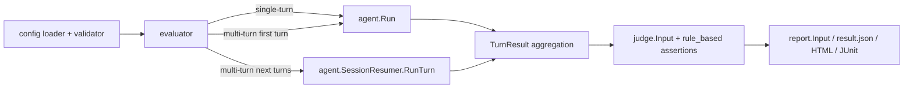

# 多轮对话评估实现计划

状态：待评审草案
来源提案：SUP-0001 多轮对话评估支持
最后评审：2026-07-03

## 目标

在 skill-up 中实现确定性的、脚本化的多轮对话评估。使用 `input.turns` 的测试用例必须逐轮执行，在轮次间保持同一个 agent 会话，评估中间的 `post_condition` 检查，捕获值供后续提示使用，将每轮结果暴露给 judge 和报告，并保持现有 `input.prompt` 用例的向后兼容。

实现应保持清晰的模块职责：

- `internal/config`：仅负责 schema 和验证。
- `internal/agent`：仅负责 agent 执行和会话恢复适配器。
- `internal/evaluator`：轮次编排、运行时生命周期、结果聚合。
- `internal/judge`：对已收集事实的断言。
- `internal/report` 和 `internal/runner`：评估事实的序列化和展示。

## 当前状态

仓库已包含重要基础：

- `internal/config.Input` 已有 `Prompt` 和 `Turns`。
- `internal/config.Turn` 已有 `Role`、`Content` 和 `PostCondition`。
- `pkg/transcript.Message` 已携带 `Turn`。
- `internal/agent.Agent.Run` 已接受 `[]transcript.Message`。
- `agent.SessionResult` 已携带 transcript、tokens、final message 和 artifacts。
- 自定义引擎已接收结构化的 `SessionInput.messages` 契约。

缺失的核心是 evaluator 执行仍将所有轮次发送给一次 `agent.Run` 调用。内置 CLI agent 随后通过 `BuildInstructionFromMessages` 折叠这些消息，因此没有真正的逐轮交互、没有中间条件检查、也没有每轮 judge 输入。

## 架构



多轮执行将是现有用例生命周期中的新分支，在运行时准备之后、当前单次调用 `agent.Run` 之前。单轮路径保持现有路径不变。

关键数据流：

1. 验证器仅接受格式良好的 `input.turns`、post conditions、capture 规则和每轮 judge 规则。
2. Evaluator 为每个用例精确启动一次用例运行时。
3. 第 1 轮调用 `Agent.Run` 创建真实的 agent 会话。
4. 后续轮次调用 `SessionResumer.RunTurn`，传入提取的会话 ID。
5. 每轮产生 evaluator 拥有的 `TurnResult`。
6. Evaluator 聚合最终 `SessionResult`、transcript、状态和 judge 输入。
7. Judge 评估全局和每轮断言，无需了解 agent 细节。
8. Runner/report 将轮次结果作为现有结果模型的一部分进行序列化。

## 模块计划

### 1. Config Schema

文件：

- `internal/config/schema.go`
- `internal/config/validator.go`
- `internal/config/schema_test.go`
- `internal/config/validator_test.go`
- `internal/config/defaults.yaml`（如示例/默认文档需要更新）

添加 schema 字段：

- `Turn.Capture []CaptureRule`
- `Turn.TimeoutSeconds int`
- `PostCondition.MustContainAll []string`
- `PostCondition.MustNotContain []string`
- `CaptureRule.Variable string`
- `CaptureRule.Pattern string`
- `CaptureRule.JSONPath string`
- `Rule.TurnResponseContains *TurnResponseContainsRule`
- `Rule.TurnResponseNotContains *TurnResponseNotContainsRule`
- `Rule.ToolCalledInTurn *ToolCalledInTurnRule`
- `Rule.ToolNotCalledInTurn *ToolNotCalledInTurnRule`

验证规则：

- 用例必须使用恰好一种有意义的输入模式：`input.prompt` 或 `input.turns`。如果两者都存在，返回验证错误以避免歧义执行。
- `input.turns[*].role` 必须为 `user`。其他角色在此阶段不需要，脚本化用户轮次不需要它们，且会使恢复语义模糊。
- `input.turns[*].content` 不得为空。
- `post_condition.on_fail` 必须为空、`fail` 或 `skip_remaining`；空表示 `fail`。
- post condition 必须包含 `must_contain_any`、`must_contain_all` 或 `must_not_contain` 中的至少一个。
- `capture[*].variable` 必须匹配保守的标识符模式，如 `^[A-Za-z_][A-Za-z0-9_]*$`。
- 每个 capture 规则必须指定恰好一个提取器：`pattern` 或 `jsonpath`。
- 正则表达式必须在验证时编译成功。
- `timeout_seconds` 必须为非负数。
- 每轮 judge 规则必须引用轮次号 >= 1，且当总轮次已知时 <= `len(input.turns)`。
- `turn_response_contains` 必须指定 `contains_all` 或 `contains_any`。
- `turn_response_not_contains.not_contains` 是必需的。
- `tool_called_in_turn.name` 和 `tool_not_called_in_turn.name` 是必需的。

设计约束：验证器不得了解 agent 实现或运行时行为。

### 2. Agent Resume 边界

文件：

- `internal/agent/agent.go`
- `internal/agent/claude_code.go`
- `internal/agent/qodercli.go`
- `internal/agent/codex.go`
- `internal/agent/*_test.go`

添加一个小可选接口，不改变 `Agent`：

```go
type SessionResumer interface {
    RunTurn(ctx context.Context, rt Runtime, opts ExecOptions, message transcript.Message, sessionID string) (*SessionResult, error)
}
```

添加 `SessionResult.SessionID string`，使 evaluator 可以在无需类型特定解析的情况下恢复会话。

职责：

- Agent 适配器知道如何启动/恢复它们自己的 CLI 会话。
- Agent 适配器将会话 ID 规范化为 `SessionResult.SessionID`。
- Evaluator 仅检查 `SessionResumer` 并将 ID 向前传递。

实现顺序：

1. `claude_code`：第一轮已生成 UUID 并传递 `--session-id`。即使输出解析未返回该 ID，也从生成的 ID 填充 `SessionResult.SessionID`。使用 `claude --resume <session-id> -p` 添加 `RunTurn`。
2. `qodercli`：切换或添加 JSON 输出路径以解析 `sessionId`。使用精确的 `-r <session-id>` 添加 `RunTurn`，而非"继续最新会话"。
3. `codex`：仅在解决安全的会话关联后实现。优先使用 CLI 输出的会话 ID。如果不可用，使用用例隔离的会话目录或会话目录的锁定前后 diff。不要在并发 `cases.parallelism` 下使用全局"最新会话"查找。
4. `custom`：暂不实现 `SessionResumer`。自定义引擎已在一个请求中接受完整消息历史，因此它们保持回退能力，直到未来设计自定义恢复契约。

边界情况：

- 第一轮后 `sessionID` 为空但仍有更多轮次时，成为明确的用例执行错误。
- 恢复命令的认证/限流处理应重用现有首次运行信号检测。
- `ExecOptions.ArtifactDir`、超时、环境变量、模型、工作空间和可观测性元数据必须在首次和恢复轮次中一致遵守。

### 3. Evaluator 多轮引擎

文件：

- `internal/evaluator/evaluator.go`
- 可能需要新的专注辅助文件，例如 `internal/evaluator/multiturn.go`
- `internal/evaluator/evaluator_test.go`

添加 evaluator 拥有的类型：

```go
type TurnStatus string

const (
    TurnCompleted TurnStatus = "completed"
    TurnSkipped   TurnStatus = "skipped"
    TurnFailed    TurnStatus = "failed"
    TurnError     TurnStatus = "error"
)

type TurnResult struct {
    TurnNumber    int
    Content       string
    Response      string
    Transcript    transcript.Transcript
    SessionResult *agent.SessionResult
    Status        TurnStatus
    Reason        string
    CapturedVars  map[string]string
}
```

执行行为：

- 仅当 `len(input.turns) > 1` 时分支到多轮。
- 对 `input.prompt` 和单轮 `input.turns` 保持现有单轮路径不变。
- 为每个用例准备一次运行时、skills、MCP、workspace diff hooks、artifact 目录和 judge 配置，然后在该运行时中执行所有轮次。
- 第 1 轮调用 `runAgent.Run`，传入单个用户消息。
- 第 2..N 轮调用 `resumer.RunTurn`。
- 每轮可能有更窄的 `turn.timeout_seconds`；整体用例超时仍限制整个用例。
- 每轮后评估 `post_condition`。
- 如果 `post_condition` 失败且 `on_fail: fail`，标记用例 `FAIL` 且不执行后续轮次。
- 如果失败且 `on_fail: skip_remaining`，标记剩余轮次跳过，仅当场景未产生可 judge 的完成路径时返回 `SKIP`。如果有完成的轮次加上跳过的后续轮次，当配置了 judge 时仍应运行，每轮规则决定最终状态。
- 在成功的 post condition 后捕获变量。
- 模板替换在发送轮次之前立即进行。未解析的 `{{variable}}` 占位符为 `ERROR`，而非发送给 agent 的原始提示文本。

结果聚合：

- 在最终 transcript 中保留每个用户轮次和助手响应，并带有正确的轮次号。
- 优先使用适配器返回的每轮 transcript；当适配器返回累积 transcript 时，在追加前进行规范化/去重。
- 最终消息是最后一个完成的轮次响应。
- `Turns` 是完成的 agent 轮次数。
- 当适配器返回每轮用量时，token 计数跨轮次求和。
- 错误/超时的 artifact 处理必须与当前单轮行为匹配。
- `Expect` 和现有全局 judge 规则针对最终聚合会话进行评估。
- 每轮 judge 规则接收 `judge.Input.TurnResults`。

避免递归陷阱：回退不得以无限重新进入多轮分支的方式调用 `executeCaseOnce`。通过专用的单次辅助函数或布尔执行模式守卫实现回退。

### 4. Post Conditions 和 Capture

文件：

- `internal/evaluator/multiturn.go`
- `internal/evaluator/multiturn_test.go`

Post-condition 语义：

- `must_contain_all`：所有必需字符串必须出现。
- `must_contain_any`：至少一个字符串必须出现。
- `must_not_contain`：不得出现任何字符串。
- 匹配最初遵循现有 `output_contains` 行为：默认区分大小写。如果需要不区分大小写的行为，在后续 schema 扩展中明确指定，而非静默偏离。
- 空 `on_fail` 表示 `fail`。
- 失败原因必须命名缺失或禁止的关键词，以便调试。

Capture 语义：

- 正则表达式捕获支持命名组 `(?P<value>...)`；如果不存在，允许恰好一个捕获组作为便利。
- 无匹配、无效组或空值为执行 `ERROR`。
- JSONPath 捕获为第 3 阶段。如果避免新依赖很重要，第 1/2 阶段保持仅正则表达式。
- 捕获的值存储在 evaluator 本地映射中，仅作用域于一个用例执行。
- 变量从不跨用例、基线变体、重试或迭代共享。
- 如果后续轮次引用未知变量，在调用 agent 之前失败。

### 5. Judge 每轮断言

文件：

- `internal/judge/judge.go`
- `internal/judge/rule_based.go`
- `internal/judge/rule_based_test.go`

添加 judge 可见的轮次结果：

```go
type TurnResult struct {
    TurnNumber int                   `json:"turn_number"`
    Content    string                `json:"content"`
    Response   string                `json:"response"`
    Transcript transcript.Transcript `json:"transcript"`
    Status     string                `json:"status"`
    Reason     string                `json:"reason,omitempty"`
}
```

添加 `TurnResults []TurnResult` 到 `judge.Input`。

规则：

- `turn_response_contains`：检查一个完成的轮次响应，使用 `contains_all` 和/或 `contains_any`。
- `turn_response_not_contains`：检查禁止字符串不在一个完成的轮次响应中。
- `tool_called_in_turn`：检查该轮次 transcript 中的工具调用，使用与 `tool_called` 相同的部分参数匹配语义。
- `tool_not_called_in_turn`：检查该轮次 transcript 中不存在。

失败行为：

- 缺失轮次对正检查是失败的断言。
- 缺失轮次在此实现中也应对 `tool_not_called_in_turn` 失败，因为验证应已拒绝不可能的轮次号，且缺失的执行轮次通常意味着场景未按预期运行。
- 跳过、失败或出错的轮次不是"完成的"；针对它的响应断言失败，证据中命名状态。

### 6. 报告和 Artifacts

文件：

- `internal/report/reporter.go`
- `internal/report/html.go`
- `internal/report/junit.go`（如果 JUnit 应在失败文本中包含轮次详情）
- `internal/runner/runner.go`
- 报告测试

添加 `TurnResults` 到 `evaluator.EvalResult` 和 `report.CaseResult`。

报告行为：

- `result.json` 和 `report.json` 包含 `turn_results`。
- `response.md` 保持为最终响应以兼容。
- 当 `report.artifacts` 包含 `transcript` 时，添加轮次 transcript artifact，尽可能使用现有 artifact 流。
- HTML 应在紧凑的用例详情部分显示每轮提示、响应、状态和原因。
- JUnit 可保持用例级别，但断言证据应包含轮次号，使 CI 失败可操作。

兼容性规则：现有报告字段保持其含义。新字段为可选，单轮用例中省略。

### 7. 文档和示例

文件：

- `docs/guide/writing-evals.md`
- `docs/zh/guide/writing-evals.md`
- `skills/skill-upper/references/case-yaml.md`
- `skills/skill-upper/assets/case.yaml.tmpl`
- `e2e/testdata/multi-turn-conversation/*`
- `CHANGELOG.md`（当实现用户可见时）

文档应解释：

- 何时使用 `input.prompt` 与 `input.turns`。
- `post_condition` 作为轮次间门控，而非 judge 的替代品。
- Capture/模板语法和失败行为。
- Agent 支持矩阵和回退行为。
- 每轮断言示例，用于阶段门控、确认、澄清、迭代优化和跨轮次引用。

更新现有 `e2e/testdata/multi-turn-conversation` 用例，使其使用真实的 `input.turns`，而非描述假轮次的单个提示。

## 分阶段交付

### 第 0 阶段：安全测试框架

目标：在行为变更之前准备测试和接口。

- 添加单元测试记录当前单轮兼容性。
- 在 evaluator 测试中添加 fake `SessionResumer` agent。
- 添加报告 fixture 期望，用于可选的 `turn_results`。

验证：

- `go test -race ./internal/config ./internal/evaluator ./internal/judge ./internal/report`

### 第 1 阶段：真实顺序多轮核心

目标：为支持恢复的 agent 顺序运行脚本化的 `input.turns`。

- 添加 `SessionResult.SessionID`。
- 添加 `SessionResumer`。
- 首先实现 `claude_code` 恢复。
- 添加 evaluator 多轮分支、轮次循环、post conditions、聚合。
- 添加带明确警告的回退模式，无递归分支。
- 添加 JSON 结果 `turn_results`。

验证：

- 单元测试覆盖 happy path、`post_condition fail`、`post_condition skip_remaining`、空 session ID、轮次超时和回退。
- 现有单轮 evaluator 测试不变通过。

### 第 2 阶段：每轮 Judge 断言

目标：让 rule-based judge 断言特定轮次响应和工具调用。

- 添加每轮规则结构和验证。
- 添加 `judge.Input.TurnResults`。
- 实现四个每轮规则评估器。
- 添加测试覆盖越界、跳过轮次、失败轮次、正负匹配和工具参数。

验证：

- `go test -race ./internal/config ./internal/judge ./internal/evaluator`

### 第 3 阶段：Capture 和模板变量

目标：支持确定性的跨轮次值传递。

- 添加正则表达式捕获。
- 添加模板渲染和未解析变量检测。
- 决定是否现在包含 JSONPath。如果是，通过 `go get` 添加依赖并记录许可证；如果否，保持 `jsonpath` 验证被拒绝，直到后续版本。
- 添加测试覆盖正则命名组、一个未命名组、无匹配、空捕获、无效变量和未解析占位符。

验证：

- `go test -race ./internal/config ./internal/evaluator`

### 第 4 阶段：更广泛的 Agent 支持和 E2E

目标：使内置 agent 支持实用且被覆盖。

- 实现 `qodercli` 精确会话恢复。
- 仅在有安全会话关联时实现 `codex`。如果不安全，对 codex 返回明确的不支持多轮错误，而非冒险跨用例污染。
- 将 `e2e/testdata/multi-turn-conversation` 转换为真实的多轮用例。
- 添加或更新 E2E 测试，在可能时使用 mock/custom agent 支持运行，并保持真实 agent E2E 像现有引擎测试一样受保护。

验证：

- `make test`
- `make verify`
- 如果触及 `e2e/` 或 `internal/runner/` 行为，也运行 `make e2e`。

## 测试矩阵

单元测试：

- Config 解析所有新字段。
- Config 拒绝歧义的 prompt+turns。
- Config 拒绝无效角色、空内容、无效 post conditions、无效 capture 规则、无效正则、无效超时和坏的每轮 judge 规则。
- Evaluator 按顺序执行轮次并将相同的会话 ID 传递给恢复的轮次。
- Evaluator 在 `post_condition fail` 时停止。
- Evaluator 在 `skip_remaining` 时跳过剩余轮次。
- Evaluator 处理第一轮后缺失的会话 ID。
- Evaluator 在用例超时内尊重每轮超时。
- Evaluator 聚合 transcript、tokens、turns、最终消息和错误。
- Capture/模板渲染成功和失败，带有清晰的诊断信息。
- Judge 每轮响应断言正确通过/失败。
- Judge 每轮工具断言正确通过/失败。
- 报告对单轮用例省略 `turn_results`，对多轮用例包含它们。

集成测试：

- 带 fake resumer 的多轮用例通过完整的 evaluator + judge。
- 多轮回退产生警告/结果模式，每轮断言明确失败。
- 基线模式为 `with_skill` 和 `without_skill` 保持独立会话。
- 重试使用新的运行时/会话和空的捕获变量重新运行整个用例。
- 即使后续轮次出错，workspace artifacts 也被收集。

E2E 测试：

- 阶段门控跳过尝试：第 1 轮进入阶段，第 2 轮尝试跳过，judge 断言第 2 轮拒绝。
- 双重确认：第 1 轮请求确认，第 2 轮仅在确认后执行。
- 捕获/引用：第 1 轮输出标识符，第 2 轮通过 `{{variable}}` 引用它。
- 报告验证：`result.json`、`report.json` 和 HTML 包含轮次详情和完整 transcript。

手动验证：

- 使用 `cases.parallelism: 1` 运行真实的 `claude_code` 多轮用例。
- 使用 `cases.parallelism: 2` 运行，验证会话不交叉。
- 运行不支持的 agent/自定义引擎，验证回退或明确的不支持诊断。

声明实现完成前的最终检查门：

```bash
make fmt
make verify
make test
make e2e   # 如果包含 e2e/ 或 internal/runner/ 变更则必需
```

## 边界情况和决策

- `input.prompt` 加 `input.turns`：验证时拒绝。
- 单个 `input.turns` 项：使用现有单轮路径，除非存在 post-condition/capture。如果存在 post-condition/capture，使用多轮机制，使这些字段生效。
- 不支持的恢复：仅当用例未声明 post conditions、capture 或每轮断言时，默认使用显式回退。否则返回 `ERROR`，因为回退无法满足声明的语义。
- 恢复 agent 的累积 transcripts：按轮次号规范化，避免在聚合 transcript 中重复先前的消息。
- 无轮次号的工具调用：当它们是每轮 `RunTurn` 结果的一部分时，分配当前轮次。
- Agent 返回空响应：post-condition 和 judge 规则正常失败；无错误的空最终响应对于无响应断言的用例仍然有效。
- 轮次超时：标记用例 `ERROR`，保留部分轮次结果，收集 artifacts。
- 用例超时：当前超时注解保持为外部权威。
- 捕获值包含花括号：视为纯文本；不递归渲染捕获的值。
- 捕获变量冲突：后续捕获可能覆盖早期变量，但轮次结果记录每轮捕获的内容。如果重复变量在实践中变得令人困惑，考虑仅添加验证器警告。
- 基线模式：`with_skill` 和 `without_skill` 绝不得共享会话 ID 或捕获变量。
- 并行用例：绝不要使用"最新会话"API 进行恢复。所有会话关联必须精确。
- 报告和评分：`post_condition fail` 是用例 `FAIL`；基础设施错误如无效模板、捕获失败、恢复失败和超时是 `ERROR`；由于 `skip_remaining` 导致场景不适用可能是 `SKIP`。

## 待讨论问题

- 不支持的 agent 应广泛使用单次回退，还是仅当用例未声明 post conditions、capture 或每轮断言时才允许回退？
- 每轮字符串匹配应像现有 `output_contains` 一样区分大小写，还是新的每轮规则应不区分大小写？
- JSONPath 捕获应包含在首次实现中，还是在正则表达式捕获稳定后发布？
- 带 `post_condition` 的单轮 `input.turns` 是否应立即使用多轮机制，即使只有一轮？
