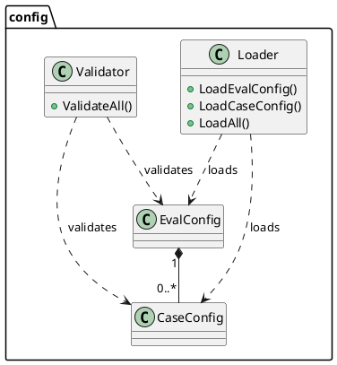
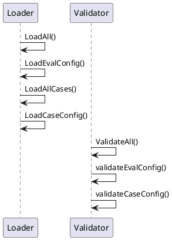

# config

Package `config` defines the evaluation configuration data model and provides loading / validation utilities for **skill-up**.

## Purpose

- Define all YAML/JSON-serialisable configuration types (`EvalConfig`, `CaseConfig`, etc.)
- Supply a single source-of-truth set of **default values** via exported constants and `DefaultEvalConfig()`
- Load `eval.yaml` and associated case files from disk (`Loader`)
- Validate loaded configurations (`Validator`)

## Exported Types

| Type | Description |
|------|-------------|
| `EvalConfig` | Root evaluation configuration (schema_version, environment, engine, cases, judge, report, …) |
| `Environment` | Runtime environment settings (type, image, workspace mount, env vars, setup steps) |
| `MCPConfig` / `MCPServer` | Model Context Protocol server definitions |
| `SkillRef` | Reference to a skill to install |
| `EngineConfig` / `ModelConfig` | Agent engine and model provider settings |
| `CasesConfig` / `CaseDefaults` / `RetryPolicy` | Test-case collection settings and defaults |
| `JudgeConfig` / `Rule` | Evaluation judge strategy and assertion rules |
| `BenchmarkConfig` | Baseline comparison toggle |
| `ReportConfig` | Output format and artifact settings |
| `CaseConfig` | Individual test case (input, context, constraints, expectations) |
| `EvalResult` | Composite result of loading an eval with its cases |
| `APIKeyConfig` | Credential descriptor for a model provider |
| `LoadMeta` | Metadata about a loaded eval |

## Default Configuration

Default values are defined in the embedded `defaults.yaml` file and loaded at package init time. Callers obtain a fully populated default config via the factory function:

```go
cfg := config.DefaultEvalConfig() // returns a deep copy of the default *EvalConfig
```

The defaults as of the embedded `defaults.yaml`:

| Field | Default Value |
|-------|--------------|
| `schema_version` | `v1alpha1` |
| `environment.type` | `none` |
| `environment.workspace_mount` | `/workspace` |
| `engine.name` | `claude_code` |
| `engine.model` | *(empty — no default provider or model name)* |
| `cases.defaults.timeout_seconds` | `300` |
| `cases.defaults.max_turns` | `10` |
| `cases.parallelism` | `1` |
| `report.formats` | `[json]` |

## Key Functions

| Function | Description |
|----------|-------------|
| `NewLoader(evalPath)` | Create a `Loader` rooted at the given `eval.yaml` path |
| `Loader.LoadEvalConfig()` | Parse `eval.yaml` into `*EvalConfig` |
| `Loader.LoadCaseConfig(path)` | Parse a single case YAML file |
| `Loader.LoadAllCases(eval)` | Load all cases referenced by `eval.Cases.Files` |
| `Loader.LoadAll()` | Load eval config + all cases in one call |
| `NewValidator()` | Create a `Validator` |
| `Validator.ValidateAll(result)` | Validate an `EvalResult` |
| `DefaultEvalConfig()` | Return a default `*EvalConfig` with sensible defaults |

`Loader.LoadCaseConfig(path)` uses the case filename stem as the default `CaseConfig.ID` when `id` is omitted in YAML. In practice, keeping `cases/<stem>.yaml` and `id: <stem>` aligned avoids ambiguity in reports and imports.

## Judge Threshold

For `judge.type: agent_judge`, `JudgeConfig.PassThreshold` uses pointer semantics:

- `nil` means "not configured", so the judge runtime applies its default threshold of `0.7`
- `0.0` is a valid explicit value and is distinct from `nil`
- validation requires any configured value to be within `[0.0, 1.0]`

## Package Dependencies

```text
config
├── os
├── path/filepath
├── time
├── fmt
├── gopkg.in/yaml.v3
└── (no internal package imports)
```

## Architecture



## Internal Call Relationships


