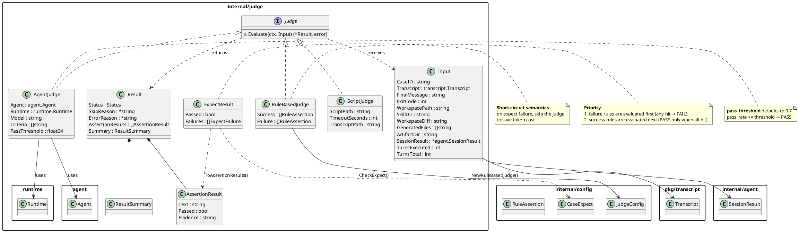

# judge — Evaluation Layer Core Package

`internal/judge` is the **evaluation layer** of the skill-up framework, responsible for grading Engine execution results.
All grading implementations share a unified `Judge` interface that takes an `Input` and returns a `*Result`.

## Feature Overview

| File | Responsibility |
|---|---|
| `judge.go` | Core interface (`Judge`) and shared data types (`Input`, `Result`, `AssertionResult`, `Status`); path safety validation (`safePath`); shared file-check helper (`fileExistsInWorkspace`) |
| `expect.go` | **Expect pre-check** — 7 lightweight checks; on failure short-circuits and skips the subsequent Judge to save tokens |
| `factory.go` | **Factory function** — creates concrete Judge instances from `JudgeConfig`; configuration merge logic |
| `rule_based.go` | **RuleBasedJudge** — declarative rule evaluation with failure-priority semantics |
| `script.go` | **ScriptJudge** — runs an external script (exit 0 = PASS), supports timeout control |
| `agent_judge.go` | **AgentJudge** — LLM-as-Judge; uses `agent.Agent` + `runtime.Runtime`; supports `pass_threshold` |

## Architecture and Module Relationships



## Evaluation Flow

```
Runner entry point
      │
      ▼
 ┌──────────────┐    failure → FAIL (short-circuit, judge not called)
 │   Expect     │──────────────────────────────────────▶ Result
 │ pre-check    │
 └──────┬───────┘
        │ pass
        ▼
 ┌──────────────┐
 │   Judge      │──▶ rule_based / script / agent_judge
 │  evaluation  │
 └──────┬───────┘
        │
        ▼
     Result (grading.json)
```

## Notes per Judge Type

### Expect Pre-check (`expect.go`)

7 check rules:

| Rule | Description |
|---|---|
| `must_contain` | The final output must contain every keyword |
| `must_not_contain` | The final output must not contain any forbidden keyword |
| `exit_code` | The process exit code must match |
| `files_exist` | The specified files in the workspace must exist |
| `files_not_exist` | The specified files in the workspace must not exist |
| `golden_file` | The final output must exactly match the golden file (path relative to the directory containing `SKILL.md`) |
| `file_contains` | The specified file must contain specific text |

### RuleBasedJudge (`rule_based.go`)

Rule assertions:

| Rule | Description |
|---|---|
| `output_contains` | Check the final output (supports `all` / `any` / `not` modes) |
| `output_matches` | Check the final output with Go regular expressions (supports `all` / `any` / `not` modes) |
| `exit_code` | Check the exit code |
| `tool_called` | Check whether a tool was invoked (supports partial argument matching) |
| `turn_response_contains` | *(merged into `output_contains.all`)* |
| `turn_response_not_contains` | *(merged into `output_contains.not`)* |
| `files_exist` | Check whether specified files exist in the workspace |
| `files_not_exist` | Check that specified files do not exist in the workspace |

### ScriptJudge (`script.go`)

- Executes an external script with the working directory set to the case workspace
- Injected env vars: `EVAL_TRANSCRIPT_PATH`, `EVAL_FINAL_MESSAGE`, `EVAL_EXIT_CODE`
- **Note**: the caller must set `TranscriptPath` before `Evaluate` (the factory does not set this field)
- Exit code 0 → PASS, non-zero → FAIL
- Default timeout 30s, configurable

### AgentJudge (`agent_judge.go`)

- Uses an `agent.Agent` + `runtime.Runtime` directly to execute the judge prompt
- Assigns stable IDs to configured criteria and keeps the configured text authoritative
- Requires `criterion_id`, `passed`, non-empty `evidence`, and explicit `failures` arrays
- `pass_threshold` (default 0.7): `pass_rate >= threshold` → PASS
- Provides the internal helper `buildJudgePrompt()` to construct the evaluation prompt
- Accepts one strict JSON object, optionally wrapped in one complete JSON code fence; unknown fields and trailing content are rejected
- Retries exactly once when strict decoding or semantic validation fails. The retry shares the original timeout budget and only asks the Judge agent to correct its output contract.
- Resumes the Judge session when the agent exposes `SessionResumer` and a session ID; otherwise it replays the original prompt, raw response, and correction prompt as a three-message history.
- Does not retry a valid FAIL judgment, explicit context cancellation, context materialization failure, or an agent error without a recoverable response.
- Persists every raw Judge response without rewriting it. The first engine artifacts remain at their existing paths and retry engine artifacts use a `retry/` subdirectory:

```text
outputs/judge/run/
├── stdout.json (or other first-attempt engine artifacts)
├── raw-response-attempt-1.txt
├── raw-response-attempt-2.txt       # only when correction runs
└── retry/
    └── stdout.json (or other retry engine artifacts)
```

The final Judge session represents the last attempt, while duration and usage metrics include the complete correction flow. Invalid output after the single correction remains an ERROR and preserves both attempts for diagnosis.

## Security

- Workspace file checks (`files_exist`, `files_not_exist`) and `golden_file` all go through `safePath()`.
  The first two are relative to the workspace; `golden_file` is relative to the skill root. Both prevent `../` path-traversal attacks.
- File-existence checks share a single helper, `fileExistsInWorkspace()`, ensuring that the `expect` layer and the `rule_based` layer use the same path-safety validation and detection logic.
- Invalid agent judge responses remain errors after the bounded correction attempt and preserve the aggregated judge session for artifact collection.

## Testing

Run all judge tests:

```bash
go test ./internal/judge/ -v -count=1 -timeout 60s
```

Run specific subsets:

```bash
# Expect pre-check (24 tests)
go test ./internal/judge/ -run TestCheckExpect -v

# Rule-based Judge (28 tests)
go test ./internal/judge/ -run TestRuleBasedJudge -v

# Script Judge (8 tests, including the ~10s timeout test)
go test ./internal/judge/ -run TestScriptJudge -v

# Agent Judge (9 tests, mock-driven)
go test ./internal/judge/ -run TestAgentJudge -v
```

| Test file | Cases | Description |
|---|---|---|
| `expect_test.go` | 24 | Full coverage of all 7 expect rules + edge cases |
| `rule_based_test.go` | 28 | 5 rule types + failure priority + partial matching |
| `script_test.go` | 8 | Normal / failure / timeout / permission errors |
| `agent_judge_test.go` | 11 | Mock LLM client + threshold edge cases + JSON parsing |
| `factory_test.go` | 8 | Factory construction + configuration merge |
| `e2e_test.go` | 12 | End-to-end pipeline integration tests |
