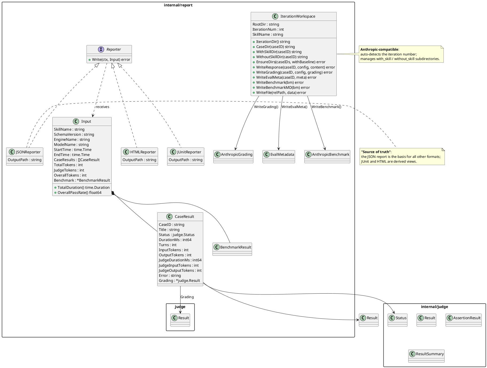

# report — Reporting and Artifact Generation Layer

`internal/report` is the **reporting layer** of the skill-up framework. It converts evaluation run results into output files in multiple formats and manages the Anthropic-compatible workspace directory structure.
All report generators share a unified `Reporter` interface that takes an `Input` and writes to a given path or stdout.

## Position in the System

The report module is the last stage of the evaluation pipeline. It receives the evaluation results from `internal/judge` and produces report artifacts for both developers and CI systems:

```
Runner executes cases
      │
      ▼
 ┌──────────────┐
 │   Judge      │──▶ judge.Result (evaluation result)
 │  (eval layer)│
 └──────┬───────┘
        │
        ▼
 ┌──────────────┐
 │  Report      │──▶ JSON / HTML / JUnit / Markdown
 │ (report layer│   benchmark.json / grading.json / eval_metadata.json
 └──────────────┘
```

This corresponds to the **Report Generator** component in the design doc (`docs/design-docs/0.1.0-design.md`) and is responsible for:
- Receiving aggregated case execution results from the Case Runner
- Computing pass rate and benchmark statistics (mean / stddev / min / max)
- Generating JSON / JUnit / HTML reports
- Producing the Anthropic-compatible workspace directory structure (`iteration-<N>/`)

## Feature Overview

| File                     | Responsibility                                                                                  |
| ------------------------ | ----------------------------------------------------------------------------------------------- |
| `reporter.go`            | Core interface (`Reporter`) and shared data types (`Input`, `CaseResult`, `BenchmarkResult`, `StatValue`, etc.) |
| `json.go`                | **JSONReporter** — machine-readable JSON report (the "source of truth"; other formats are derived views) |
| `html.go`                | **HTMLReporter** — human-readable HTML evaluation report with summary cards and a per-case detail table |
| `junit.go`               | **JUnitReporter** — JUnit XML report consumable by CI systems                                    |
| `grading.go`             | Writers for the Anthropic-compatible `grading.json` and `eval_metadata.json`                     |
| `benchmark.go`           | Benchmark statistics computation (mean / stddev / min / max)                                     |
| `benchmark_anthropic.go` | Type definitions and computation for the Anthropic full-format `benchmark.json`                  |
| `benchmark_md.go`        | Human-readable Markdown benchmark report (`benchmark.md`)                                        |
| `workspace.go`           | **IterationWorkspace** — manages the Anthropic-compatible `iteration-<N>/` directory structure and artifact writes |
| `template_helpers.go`    | Shared helpers for HTML templates (formatting time, percentages, nil checks, etc.)               |
| `helpers.go`             | Generic JSON file writer helper (`writeJSONFile`)                                                |
| `templates/`             | Embedded HTML template directory (`report.html`, `review.html`), loaded via `go:embed`; `review.html` template exists but the Go generator is not yet implemented |

## Architecture and Module Relationships



## Report Generators

### JSONReporter (`json.go`)

- Directly serializes `Input` to formatted JSON
- Acts as the "source of truth" for every report format
- When the output path is empty, writes to stdout

### HTMLReporter (`html.go`)

- Rendered with the standard library's `html/template`; the template is loaded via `go:embed` from `templates/report.html`
- Bundles responsive CSS styles
- Displays: skill name, engine, model, start time, evaluation wall time, pass rate, and separated tested-agent / judge / overall token totals
- Summary cards: Total / Passed / Failed / Skipped / Errors / Pass Rate
- Per-case details: compact tested-agent and optional agent-judge metrics beside the case heading, plus status icons, assertion results, and evidence; input/output token counts remain available as hover details
- Benchmark cases show compact with-Skill, without-Skill, and delta metrics beside the case heading so execution cost remains secondary to the response and grading content

### Metric semantics

- `Input.TotalDuration()` is **evaluation wall time** (`EndTime - StartTime`). It
  includes orchestration, tested-agent execution, judging, and other framework
  overhead, so it is not expected to equal the sum of visible case execution
  times, especially when cases run concurrently.
- `CaseResult.DurationMs` is **tested-agent execution time** for that case and
  configuration. It is the primary duration for comparing Skill behavior.
- `CaseResult.InputTokens` and `OutputTokens` are tested-agent token usage.
  `Input.TotalTokens` retains its existing JSON name for compatibility and is
  the sum of those tested-agent tokens across all configurations.
- `JudgeDurationMs`, `JudgeInputTokens`, and `JudgeOutputTokens` are populated
  when the judge runs a separate agent session. `Input.JudgeTokens` aggregates
  those tokens, and `Input.OverallTokens` is tested-agent plus judge tokens.

### JUnitReporter (`junit.go`)

- Generates standard JUnit XML for CI systems (Jenkins, GitHub Actions, etc.) to consume
- Mapping rules:
  - Each case → `<testcase>`
  - `StatusFail` → `<failure>` element (with details about failed assertions)
  - `StatusError` → `<error>` element
  - `StatusSkip` → `<skipped>` element

## Anthropic-Compatible Data Formats

### grading.json (`grading.go`)

- `AnthropicGrading`: contains `expectations` (per-assertion text / passed / evidence) and `summary` (passed / failed / total / pass_rate)
- `ConvertToAnthropicGrading()`: converts the internal `judge.Result` into the Anthropic format
- `EvalMetadata`: corresponds to per-case `eval_metadata.json` (eval_id / eval_name / prompt / assertions)

### benchmark.json (`benchmark.go` + `benchmark_anthropic.go`)

Provides two layers of data structures:

**Simplified mode** (internal statistics, `benchmark.go` — `BenchmarkResult`):
- `BenchmarkStats`: pass_rate / time_seconds / tokens, each with mean + stddev
- `BenchmarkDelta`: deltas between the two configurations

**Anthropic full format** (`benchmark_anthropic.go` — `AnthropicBenchmark`):
- `BenchmarkMetadata`: skill name, path, timestamp, eval ID list
- `BenchmarkRun`: per-run details (pass_rate / passed / failed / total / time_seconds / tokens)
- `AnthropicRunSummary`: per-configuration statistics summary with mean / stddev / min / max
- `AnthropicDelta`: deltas formatted as strings

### benchmark.md (`benchmark_md.go`)

- Generates a human-readable Markdown benchmark report
- Includes a summary table (Pass Rate ± StdDev) and per-case results
- Supports both with-baseline and no-baseline display modes

## Workspace Management (`workspace.go`)

`IterationWorkspace` manages the Anthropic-compatible evaluation artifact directory layout:

```
<skill-name>-workspace/
  iteration-<N>/
    benchmark.json
    benchmark.md
    <case-id>/
      eval_metadata.json
      with_skill/
        outputs/
          response.md
        grading.json
      without_skill/          # Optional; only when benchmark.enabled=true
        outputs/
          response.md
        grading.json
```

Key behaviors:
- `NewIterationWorkspace()`: creates the `iteration-N/` directory using the iteration number provided; requires `N >= 1`
- `EnsureDirs()`: bulk-creates per-case directory structures and can optionally create the `without_skill` subdirectory
- `WriteResponse()` / `WriteGrading()` / `WriteEvalMeta()` / `WriteBenchmark()`: write artifact files at the corresponding locations

## Template Helpers (`template_helpers.go`)

Template functions shared by every HTML report:

| Function           | Description                                              |
| ------------------ | -------------------------------------------------------- |
| `fmtDuration`      | Milliseconds → seconds (e.g. `1500` → `"1.5s"`)          |
| `fmtPercent`       | Float → percent (e.g. `0.85` → `"85%"`)                  |
| `fmtPercentSigned` | Signed percent (e.g. `+0.1` → `"+10%"`)                  |
| `passFailClass`    | Bool → CSS class (`"pass"` / `"fail"`)                   |
| `passFailIcon`     | Bool → HTML icon (✅ / ❌)                                 |
| `notNil`           | Generic nil check (pointer, interface, slice, map, ...)   |
| `derefFloat`       | Safely dereference `*float64` (nil → 0)                  |

## Package Dependencies

| Dependency       | Purpose                                                                                                                            |
| ---------------- | ---------------------------------------------------------------------------------------------------------------------------------- |
| `internal/judge` | Imports the constants `Status`, `StatusPass`, `StatusFail`, `StatusSkip`, `StatusError` and the structs `Result`, `AssertionResult`, `ResultSummary` |

Standard library: `context`, `embed`, `encoding/json`, `encoding/xml`, `fmt`, `html/template`, `io`, `math`, `os`, `path/filepath`, `reflect`, `regexp`, `sort`, `strconv`, `strings`, `time`

## Testing

Run all report tests:

```bash
go test ./internal/report/ -v -count=1 -timeout 60s
```

Run specific subsets:

```bash
# Reporter interface implementation tests
go test ./internal/report/ -run TestReporter -v

# Benchmark computation tests
go test ./internal/report/ -run TestBenchmark -v
go test ./internal/report/ -run TestBenchmarkMd -v

# Grading conversion tests
go test ./internal/report/ -run TestGrading -v

# Workspace directory management tests
go test ./internal/report/ -run TestWorkspace -v

# E2E integration tests
go test ./internal/report/ -run TestE2E -v
```

| Test file              | Description                                              |
| ---------------------- | -------------------------------------------------------- |
| `reporter_test.go`     | Reporter interface implementations + Input methods       |
| `benchmark_test.go`    | Statistics functions: Mean / StdDev / PassRate / ComputeBenchmark, etc. |
| `benchmark_md_test.go` | Markdown benchmark report generation                     |
| `grading_test.go`      | Anthropic grading.json conversion and writing            |
| `workspace_test.go`    | IterationWorkspace directory creation and artifact writing |
| `e2e_test.go`          | Full-pipeline integration tests                          |
