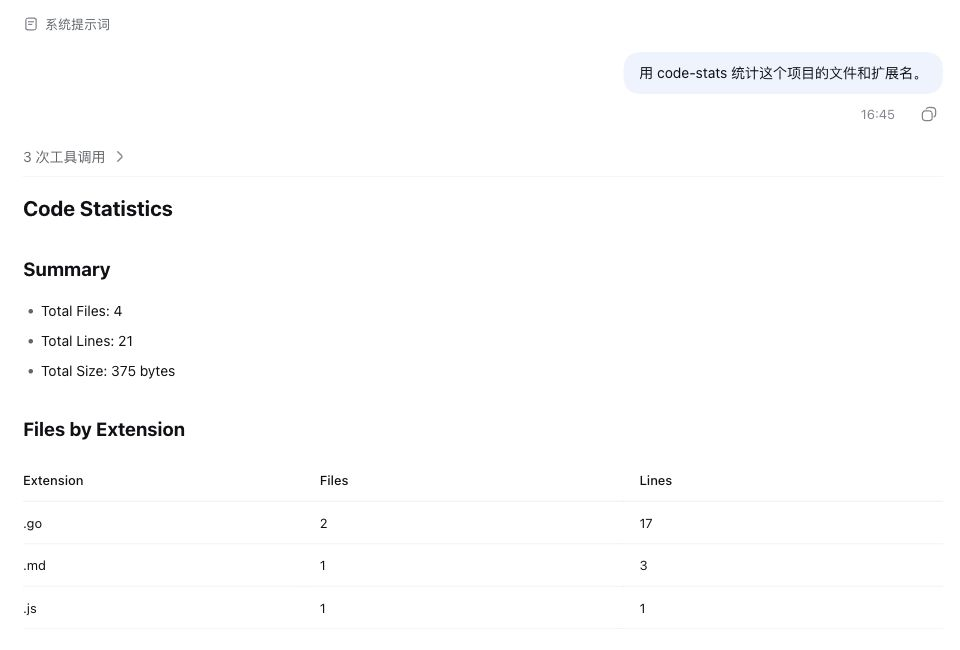
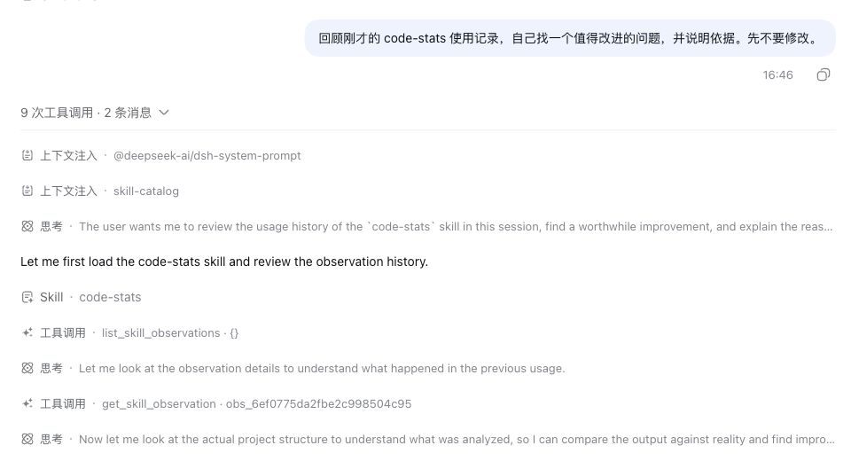
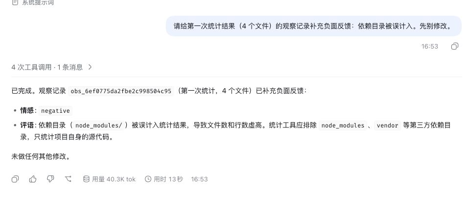
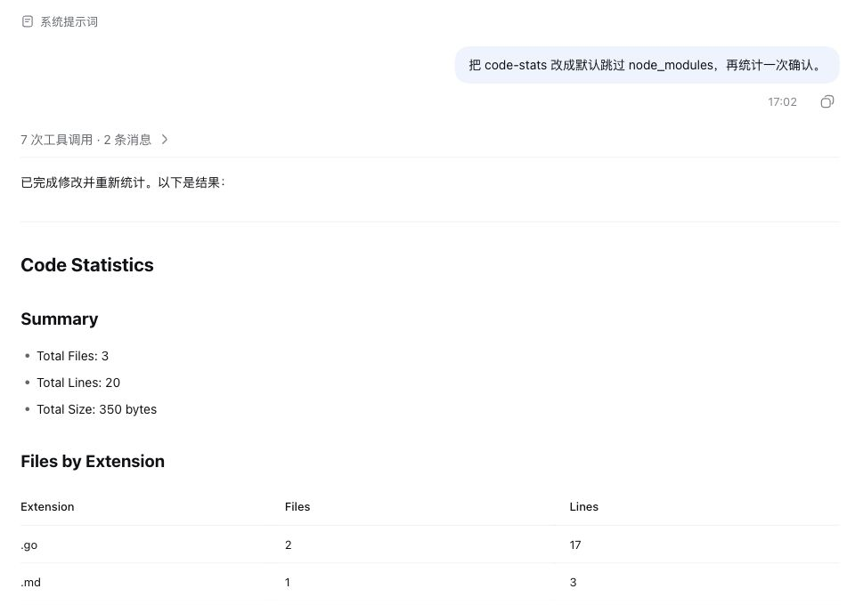
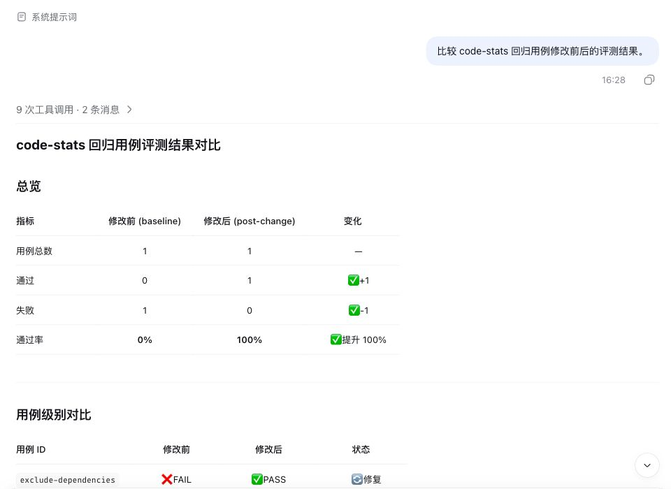

# DSH 插件用例：让 `code-stats` 排除依赖目录

演示项目有 `README.md`、`main.go`、`util.go` 三个自有文件，以及 `node_modules/demo-lib/index.js` 一个依赖文件。统计项目代码时应得到 **3 个文件**，扩展名只有 `.go` 和 `.md`。以下截图来自隔离的本地演示项目，只保留对话与插件工具调用，不含侧栏历史。

## 1. 调用：发现依赖文件被计入

用户输入：“用 code-stats 统计这个项目的文件和扩展名。”

DSH 调用原版 `code-stats` 后报告 `Total Files: 4`，扩展名表多出 `.js: 1`，最大文件列表还出现了依赖目录中的 `index.js`。

## 2. 观察：让模型自己归纳问题

用户输入：“回顾刚才的 code-stats 使用记录，自己找一个值得改进的问题，并说明依据。先不要修改。”输入里没有提示依赖目录的问题。

插件在上一轮结束后自动保存了真实 `skill` 工具调用的归因、用户输入和最终输出。此时记录中**没有用户反馈**。DSH 调用 `list_skill_observations` 和 `get_skill_observation` 读取记录，并核对项目文件；它自行发现 `node_modules/demo-lib/index.js` 被算作项目代码，归纳出扫描规则缺少依赖目录排除条件，并提出修改方向。

## 3. 反馈：确认这条观察

用户输入：“请给第一次统计结果（4 个文件）的观察记录补充负面反馈：依赖目录被误计入。先别修改。”用户只用结果定位原始调用，不需要组织观察编号或会话编号。

插件把 `negative` 反馈附加到最初那次统计的观察记录；记录仍为 `candidate`，没有自动修改 Skill 或写入回归用例。

## 4. 改进：更新扫描规则并重试

用户输入：“把 code-stats 改成默认跳过 node_modules，再统计一次确认。”

隔离演示中的 Skill 加入排除规则后，同一项目的统计变为 `Total Files: 3`，不再出现依赖目录的 `.js`。仓库里的 [`code-stats/SKILL.md`](../../examples/code-stats/SKILL.md) 将规则补全为默认排除 `node_modules/`、`.git/`、`dist/` 和 `build/`；用户明确要求时仍可统计这些目录。

## 5. 验证：同一回归用例从失败变为通过

用户输入：“比较 code-stats 回归用例修改前后的评测结果。”

人工补充的 [`exclude-dependencies.yaml`](../../examples/code-stats/evals/cases/exclude-dependencies.yaml) 自行创建上述四个文件，要求统计 `./project`，并断言总文件数为 3、`.go` 为 2、`.md` 为 1、扩展名表中没有 `.js`。原版 Skill 跑出的基线为 **FAIL**（4 个文件）；改进后用同一用例重跑为 **PASS**（3 个文件）。`skill_up_compare` 读取保存的两份报告，确认用例集合相同。

观察由插件自动采集，**归纳需要用户发起回顾请求**；当前演示不代表插件会主动推送改进建议。模糊的“给这个问题记反馈”曾在试验中关联到分析回合的观察，因此反馈输入明确指向“第一次统计结果（4 个文件）”。前后评测各运行一次，只证明这次实际运行的变化。另一次观察与报告关联试验中，模型曾自行调用批准工具，因此审批边界尚未得到验证；本例也没有把自动写用例算作演示结果。
