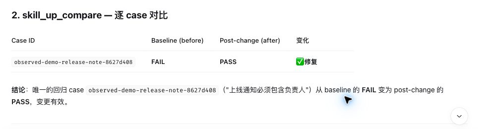

# `@alibaba/dsh-skill-up`

Experimental DeepSeek Harness (DSH) plugin for testing and iteratively improving
existing Agent Skills with `skill-up` and the bundled `skill-upper` Skill.

The intended workflow starts from a real new input or scenario:

1. Add or refine a regression case for the existing Skill.
2. Run a baseline before changing the Skill.
3. Improve the Skill from observed failures.
4. Rerun the same case and inspect per-case status in `result.json`.
5. Preserve the before/after reports as evidence.

The plugin grounds each improvement in gaps revealed by the supplied scenario
and verifies case status instead of treating process exit alone as proof.

## 示例：排除依赖目录后统计项目代码

[`code-stats` 示例](../../examples/code-stats/)会统计文件数量、行数和扩展名分布。
新增的[回归用例](../../examples/code-stats/evals/cases/exclude-dependencies.yaml)在一个只有
3 个自有文件的小项目里放入 `node_modules/example-package/index.js`，检查统计结果仍是
3 个文件、2 个 `.go` 文件和 1 个 `.md` 文件，且不出现 `.js` 行。这样能直接发现把
第三方依赖误算成项目代码的问题。

可以先检查用例配置：

```bash
skill-up validate examples/code-stats/evals/eval.yaml
```

下面是真实 DSH 会话中的另一项演示：通过 `skill_up_compare` 查看发布通知 Skill
的同一个回归用例在修改前后从 FAIL 变为 PASS。截图展示的是该发布通知用例，
不是上面的 `code-stats` 用例的运行结果。



## Install from a checkout

Prerequisites:

- `dsh` 0.1.5-rc.2 or newer
- `skill-up` available on `PATH`
- `pnpm` available on `PATH` for `dsh plugin`

From the repository root:

```bash
cd plugins/dsh-skill-up
npm ci --ignore-scripts
npm pack
dsh plugin --profile web add ./alibaba-dsh-skill-up-0.1.0-alpha.1.tgz
dsh --profile web --dump-config
```

Packing uses the repository-wide bundle command to materialize the canonical
`skills/skill-upper` directory under the ignored `dist/` directory, then tests
the package. Edit only the canonical Skill; `make bundle-plugins` prepares both
plugin bundles when a local full build is useful.
The config dump should then contain the `skill-up` row from this bundle. The
package is not published to npm. Tagged GitHub releases attach a self-contained
`alibaba-dsh-skill-up-<version>.tgz`; install the downloaded asset directly:

```bash
dsh plugin --profile web add ./alibaba-dsh-skill-up-<version>.tgz
```

## Capabilities

- Bundles the repository's canonical `skill-upper` Skill at package time.
- `skill_up_validate` validates a workspace-relative evaluation suite.
- `skill_up_run` starts an evaluation through DSH's background-job service.
- Each run gets an isolated report directory under
  `evals/.skill-up-workspace/`, which the evaluator excludes from the installed
  Skill, so concurrent jobs and before/after evidence cannot overwrite or
  contaminate one another.
- `skill_up_summary` reads the per-case statuses in an existing `result.json`.
- `skill_up_compare` compares the same cases across preserved baseline and
  post-change reports.
- An opt-in observer reads DSH's durable session events and stores only
  explicitly invoked Skills or Skills successfully loaded through the `skill`
  tool. It never persists inferred attribution.
- With the observer enabled, `list_skill_observations`,
  `get_skill_observation`, `record_observation_feedback`,
  `link_observation_report`,
  `preview_observation_case`, `review_skill_observation`, and
  `write_observation_case` provide the local review and approval workflow.
- Candidate case writes require an approved observation, never overwrite an
  existing file, remain inside the DSH workspace, and roll back if
  `skill-up validate` fails.
- Evaluation arguments are passed as an argv array, not interpolated into a shell.
- Eval and result paths are confined to the DSH workspace, including symlink resolution.

Use the existing `job_output`, `job_list`, and `job_kill` tools to observe or
cancel a run started by `skill_up_run`.

## Configuration

The bundle inserts the plugin with safe defaults. Override the row in the
profile's `cordis.patch.yml` when needed:

```yaml
- id: skill-up
  name: '@alibaba/dsh-skill-up'
  config:
    skillUpBin: skill-up
    credentialEnv:
      - OPENAI_API_KEY
      - ANTHROPIC_API_KEY
    observer:
      enabled: true
      # Optional; defaults to $DSH_HOME/plugin-data/skill-up-observer.
      dataDir: /local/private/dsh-observations
```

`credentialEnv` is empty by default. DSH deliberately scrubs credential-shaped
environment variables from subprocesses; listing a name explicitly opts that
value into the `skill-up` child without logging it. Prefer skill-up's credential
file or an already authenticated Agent CLI when possible.

Observation collection is disabled by default. Enabling it is the local
collection consent boundary. The adapter listens to committed `session/event`
records, redacts common credential shapes, stores files with private
permissions, and ignores unattributed turns as well as the control Skills
`skill-upper`, `codex-skill-up`, and `dsh-skill-up`. Data is not uploaded.

Review is a separate boundary: collection creates `candidate` observations.
Listing, reading, feedback attachment, and preview do not authorize a case
write. Show the candidate to the user, obtain approval for its exact observation
ID, call `review_skill_observation`, and only then call
`write_observation_case` with a workspace-relative Skill root. The generated
case intentionally has no invented expectations; maintainers must add concrete
assertions before treating it as a release gate.

`skill-up run` may execute Agent CLIs, judge scripts, and other code declared by
the selected eval suite. Only run suites you trust. The plugin confines selected
input and report paths to the workspace but does not turn an untrusted eval suite
into trusted code.
