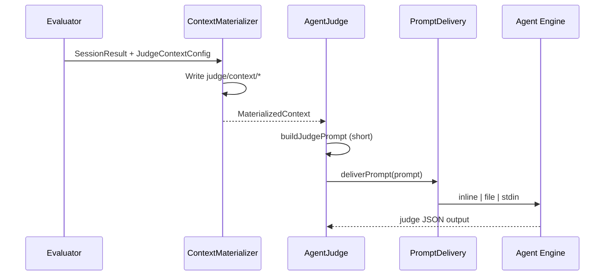

# SUP-0004: Agent Judge Context Delivery and Scale Control

Language: English | [中文](zh/0004-agent-judge-context-delivery.md)

<!-- toc -->
- [Summary](#summary)
- [Motivation](#motivation)
  - [Goals](#goals)
  - [Non-Goals](#non-goals)
- [Requirements](#requirements)
- [Proposal](#proposal)
  - [User Scenario Quick Reference](#user-scenario-quick-reference)
  - [Schema Shape](#schema-shape)
  - [Prompt Delivery (All Agents)](#prompt-delivery-all-agents)
  - [Context Materialization (`agent_judge`)](#context-materialization-agent_judge)
  - [Runtime Behavior](#runtime-behavior)
  - [Notes/Constraints/Caveats](#notesconstraintscaveats)
  - [Risks and Mitigations](#risks-and-mitigations)
- [Design Details](#design-details)
  - [Schema Changes](#schema-changes)
  - [PromptDelivery](#promptdelivery)
  - [ContextMaterializer](#contextmaterializer)
  - [AgentJudge Changes](#agentjudge-changes)
  - [Evaluator Changes](#evaluator-changes)
  - [Observability](#observability)
  - [Documentation and Templates](#documentation-and-templates)
- [Test Plan](#test-plan)
- [Drawbacks](#drawbacks)
- [Alternatives](#alternatives)
- [Infrastructure Needed](#infrastructure-needed)
- [Upgrade & Migration Strategy](#upgrade--migration-strategy)
<!-- /toc -->

## Summary

skill-up's `agent_judge` currently inlines the full agent `transcript`, `final_message`, and `workspace_diff` into a single judge prompt string, then passes that string to Agent Engines such as Claude Code through `bash -c 'claude -p "<entire prompt>"'`. Long-running cases with many tool calls and large workspace diffs can exceed the OS `ARG_MAX` limit and fail with `fork/exec /usr/bin/bash: argument list too long`.

This proposal introduces two complementary layers:

1. **Prompt delivery (all agents)**: automatically switch large prompts to file or stdin delivery instead of argv embedding.
2. **`judge.context` (agent_judge only)**: let authors declare which evaluation materials to materialize, reference, omit, or truncate via profiles `minimal` and `standard`.

The design aligns `agent_judge` with the existing `script_judge` pattern of passing artifacts by path, while preserving criteria + evidence JSON grading.

## Motivation

Production CI for a long-running skill eval (a high-load case) reproduced the failure below after the main agent completed and the judge phase started:

```text
claude-code run failed: fork/exec /usr/bin/bash: argument list too long
agent_judge failed to parse agent output: no valid JSON found in agent output
```

The root cause is two-layered:

| Layer | Mechanism | Effect |
| --- | --- | --- |
| Delivery | `internal/agent/claude_code.go` → `buildClaudePrintCmd` | Entire instruction is shell-quoted into argv |
| Content | `internal/judge/agent_judge.go` → `buildJudgePrompt` | Inlines transcript JSON, workspace diff, and final message |

For long cases (`timeout_seconds: 3600`, `max_turns: 50`), transcript size alone can reach megabytes. `agent_judge` also collects workspace git diff by default (`judgeNeedsWorkspaceDiff` returns true for all `agent_judge` configs), which can be large when the workspace contains full application checkouts.

A single boolean such as `include_transcript: false` would help one scenario but would not solve:

1. Large `workspace_diff` independent of transcript.
2. Large case prompts for the main agent (same argv delivery path).
3. Future common cases: multi-turn evals, code-review skills, repository-change benchmarks.
4. Lack of observability when judge context is truncated or downgraded.

### Goals

1. **Eliminate ARG_MAX class failures** for agent and judge invocations under normal large-eval workloads.
2. **Configurable judge context**: control material scope via `judge.context` (profile / attachments); **criteria style stays unchanged**.
3. **Safe defaults**: new evals should not silently inline megabyte-scale context into argv.
4. **Alignment with script_judge**: materialize large artifacts to disk and reference them by path.
5. **Observability**: reports record materialization mode, sizes, truncation, and prompt delivery mode.
6. **Backward compatibility path**: existing short-prompt evals keep current inline behavior.

### Non-Goals

1. **No change to `rule_based` semantics**: in-memory transcript assertions remain unchanged.
2. **No replacement of `agent_judge` with `script_judge`**: this proposal keeps LLM grading with criteria + evidence.
3. **No direct HTTP/API judge path**: engines continue to run through existing CLI adapters in MVP.
4. **No automatic criteria inference in MVP**: profile selection remains explicit; smart recommendations are a follow-up.
5. **No cross-case sharing of judge context files**: each case variant keeps its own `judge/context/` directory.

## Requirements

### Must Have

| ID | Requirement | Acceptance Criteria |
| --- | --- | --- |
| R1 | Large prompt delivery | Prompts above threshold use file or stdin delivery; `claude_code` no longer fails with `argument list too long` on multi-MB judge prompts |
| R2 | `judge.context` schema | `JudgeConfig` accepts `context` with `profile` and per-field modes |
| R3 | Context materialization | `agent_judge` writes transcript/diff/final message/attachments under `judge/context/` when configured |
| R4 | Short judge prompt | Default `standard` profile produces a judge prompt bounded by a fixed small size (path references, not full inline JSON) |
| R5 | Auto downgrade | `include` mode still respects `limits.max_bytes` and downgrades to `file_ref` when exceeded |
| R6 | Report metadata | `grading.json` / `result.json` includes `judge_context` manifest |
| R7 | Backward compatibility | Short-prompt evals without `judge.context` continue to pass existing tests |

### Should Have

| ID | Requirement | Acceptance Criteria |
| --- | --- | --- |
| S1 | Profile presets | `minimal` and `standard` documented with clear semantics |
| S2 | `attachments` support | Authors can attach business artifacts (for example `diff-result.json`) by path |
| S3 | Engine parity | `codex`, `qodercli`, `qwen_code` use the same `PromptDelivery` helper |
| S4 | Writing guide updates | English and Chinese eval writing guides include `judge.context` examples |

### Nice to Have

| ID | Requirement | Acceptance Criteria |
| --- | --- | --- |
| N1 | ARG_MAX probe | Optional pre-exec size check with warn log and forced file mode |
| N2 | `skill-up validate` hints | Suggest `profile: minimal` when `attachments` are configured but the profile still inlines large transcript |
| N3 | Shared materialize package | `script_judge` and `agent_judge` reuse the same artifact writer |

## Proposal

### User Scenario Quick Reference

#### Scenario 1: Long Repository-Change Benchmark (`profile: minimal`)

The judge primarily relies on script outputs and diff files, not conversation history:

```yaml
judge:
  type: agent_judge
  model: anthropic/claude-sonnet-4-6
  context:
    profile: minimal
    attachments:
      - path: evals/fixtures/artifacts/diff-result.json
        label: diff_result
  criteria:
    - "Determine whether code changes meet the expected rules."
    - "If results match expected after filtering temp dirs, pass with verifiable evidence."
  pass_threshold: 1
```

Key points:

- Transcript and workspace diff are omitted from the judge prompt.
- Business evidence is materialized via `attachments`; **paths are auto-injected into the judge materials table**—authors do not declare file paths in criteria.
- Judge prompt stays small; the judge agent decides which attachments to read based on criteria.

#### Scenario 2: Code Review Skill (`profile: standard`, default)

```yaml
judge:
  type: agent_judge
  model: anthropic/claude-sonnet-4-6
  context:
    profile: standard
  criteria:
    - "Identified real bugs with accurate locations"
    - "Did not false-positive correct code"
```

Effective behavior:

- `transcript.json`, `workspace.diff`, and `final_message.txt` are written under `judge/context/`.
- The framework **auto-injects a materials table** (paths, sizes, modes) into the judge prompt; **criteria are written the same as today**—no need to mention filenames.
- The judge agent opens whichever files it needs based on criteria when writing evidence.
- Looser truncation or retention can be tuned under `standard` via `limits` and per-field overrides (no extra profile).

### Per-Field Delivery Modes

`final_message`, `transcript`, `workspace_diff`, and similar fields can each override the profile default:

| Mode | In judge prompt | On disk | Purpose |
| --- | --- | --- | --- |
| `include` | Full text inlined | Optional mirror | Short material; judge should see it immediately |
| `file_ref` | Path/reference only, no full body | Full file required | Large material; avoids blowing up prompt / argv (`standard` default for transcript and diff) |
| `omit` | Not present | Not written | Material not needed for grading (`minimal` default for transcript and diff) |
| `truncate` | Inline summary + "full text at path" | Full version written | Preview in prompt, full text on disk (`minimal` default for `final_message`) |

**Safety net**: even with `include`, the framework auto-downgrades to `file_ref` when a segment exceeds `limits.max_bytes`.

`generated_files` uses similar semantics: `omit`, `index` (paths only), or `include` (inline content).

### Author Experience: Transparent Material Delivery

Previously, `agent_judge` **inlined** transcript, diff, and related materials into the judge prompt. Authors only wrote `criteria` and did not think about how materials were delivered.

This proposal **changes delivery only, not the author mental model**:

1. The framework materializes materials per `profile` / per-field settings and **auto-injects a materials table** into the judge system prompt (field name, path, size, truncation flag).
2. The framework adds **fixed review instructions** (for example: read files from the materials table as needed for the criteria; evidence in the JSON response must be traceable to specific materials).
3. Author `criteria` **still describe what to grade**—authors generally **do not** need to say "read transcript.json" or attachment paths. Configured `attachments` also appear in the materials table automatically.
4. The judge agent **decides which files to open**, like the main agent using Read tools.

From the author's perspective: write criteria → judge grades. The only change is under the hood—materials are no longer stuffed into argv; the framework provides a "menu" for the judge to consume on demand.

### Schema Shape

Add optional `context` to `JudgeConfig`. Case-level `judge` may override eval-level `context` using existing `MergeJudgeConfig` precedence.

```yaml
judge:
  type: agent_judge
  context:
    profile: standard          # minimal | standard
    final_message: include     # include | omit | truncate | file_ref
    transcript: file_ref       # include | omit | truncate | file_ref
    workspace_diff: file_ref   # include | omit | truncate | file_ref
    generated_files: index     # omit | index | include
    limits:
      max_bytes: 65536
      transcript_max_turns: 20
      workspace_diff_max_lines: 500
    attachments:
      - path: relative/or/absolute/path
        label: optional_label
```

Profile defaults when fields are omitted:

| Profile | transcript | workspace_diff | final_message |
| --- | --- | --- | --- |
| `minimal` | `omit` | `omit` | `truncate` |
| `standard` | `file_ref` | `file_ref` | `include` |

When `judge.context` is entirely omitted, the evaluator applies `profile: standard` (behavior change from today's implicit full inline).

### Prompt Delivery (All Agents)

Introduce `internal/agent/prompt_delivery.go`:

| Mode | When | Command shape |
| --- | --- | --- |
| `inline` | `len(instruction) <= threshold` | Current `claude ... 'instruction'` |
| `file` | Above threshold (default fallback) | Write `$ARTIFACT_DIR/prompt.txt`, invoke CLI with path or wrapper |
| `stdin` | Engine supports reading `-p` from stdin | Pipe instruction to process |

Constants:

- Default `SKILL_UP_PROMPT_INLINE_MAX_BYTES = 32768`
- Overridable via environment variable

All built-in engines (`claude_code`, `codex`, `qodercli`, `qwen_code`) route `Run()` instructions through `deliverPrompt(ctx, rt, opts, instruction)`.

### Context Materialization (`agent_judge`)

Introduce `internal/judge/context_materializer.go`:

Output directory:

```text
{outputDir}/{caseId}/{variant}/judge/context/
  manifest.json
  transcript.json
  workspace.diff
  final_message.txt
  attachments/
```

`buildJudgePrompt` receives a `MaterializedContext` and emits:

1. **Criteria** (author-written, unchanged)
2. **Materials table** (framework-generated: key, path, size, mode, truncated flag)
3. **Review instructions** (framework template: read files from the materials table as needed for criteria; evidence must be traceable)
4. **Required JSON response schema**

No multi-megabyte JSON blobs in the prompt string; authors do not repeat material paths in criteria.

### Runtime Behavior



Merge semantics:

- Eval-level `judge.context` is the base.
- Case-level `judge.context` overrides eval-level fields when present (same pattern as other judge fields).
- Unset fields inherit from the resolved profile.

### Notes/Constraints/Caveats

1. **Judge agent must be able to read files** in the workspace or artifact directory. For `environment.type: none`, paths must be absolute or workspace-relative and readable by the engine process.
2. **`include` is not unbounded**: framework may auto-downgrade to `file_ref` when `limits.max_bytes` is exceeded.
3. **`attachments.path`** resolves relative to the skill directory, consistent with `script_path` and MCP `config_ref`.
4. **Behavior change**: omitting `judge.context` no longer means "inline everything"; it means `profile: standard`.
5. **Main agent benefits immediately** from `PromptDelivery` even before authors tune `judge.context`.

### Risks and Mitigations

| Risk | Mitigation |
| --- | --- |
| Judge LLM ignores the materials table and guesses | Framework injects materials table and read-file instructions in every judge prompt; e2e verifies traceable evidence |
| `standard` profile breaks evals expecting inline transcript | Document migration; use `standard` + `transcript: include` for legacy behavior within limits |
| File mode unsupported by a future engine | `PromptDelivery` falls back per engine capability matrix |
| Disk usage in CI | Context dir lives under existing output artifacts; optional cleanup on `rt.Close()` |
| Attachment path escapes workspace | Validate paths; reject `..` traversal outside skill dir and workspace |

## Design Details

### Schema Changes

```go
type JudgeConfig struct {
    // existing fields...
    Context *JudgeContextConfig `yaml:"context,omitempty"`
}

type JudgeContextConfig struct {
    Profile        string                   `yaml:"profile,omitempty"`
    FinalMessage   string                   `yaml:"final_message,omitempty"`
    Transcript     string                   `yaml:"transcript,omitempty"`
    WorkspaceDiff  string                   `yaml:"workspace_diff,omitempty"`
    GeneratedFiles string                   `yaml:"generated_files,omitempty"`
    Limits         *JudgeContextLimits      `yaml:"limits,omitempty"`
    Attachments    []JudgeContextAttachment `yaml:"attachments,omitempty"`
}

type JudgeContextLimits struct {
    MaxBytes              int `yaml:"max_bytes,omitempty"`
    TranscriptMaxTurns    int `yaml:"transcript_max_turns,omitempty"`
    WorkspaceDiffMaxLines int `yaml:"workspace_diff_max_lines,omitempty"`
}

type JudgeContextAttachment struct {
    Path  string `yaml:"path"`
    Label string `yaml:"label,omitempty"`
}
```

Validator rules:

1. `profile` must be one of `minimal` or `standard` when set.
2. Field modes must be one of `include`, `omit`, `truncate`, `file_ref`.
3. `attachments[].path` must be non-empty.
4. `limits.max_bytes` must be non-negative.

### PromptDelivery

Location: `internal/agent/prompt_delivery.go`

```go
func deliverPrompt(ctx context.Context, rt Runtime, opts ExecOptions, instruction string) (command string, err error)
```

Responsibilities:

1. Compare `len(instruction)` with `inlineMaxBytes()`.
2. When using file mode, write to `filepath.Join(opts.ArtifactDir, "prompt.txt")`.
3. Return a short shell command that does not embed the full instruction.
4. Record delivery mode in context for observability.

### ContextMaterializer

Location: `internal/judge/context_materializer.go`

```go
type MaterializedContext struct {
    Dir       string
    Manifest  ContextManifest
    Materials []ContextMaterial
}

func MaterializeJudgeContext(
    ctx context.Context,
    rt runtime.Runtime,
    cfg *config.JudgeContextConfig,
    in Input,
    artifactDir string,
) (*MaterializedContext, error)
```

Responsibilities:

1. Resolve effective config from profile + explicit overrides.
2. Write selected artifacts under `judge/context/`.
3. Copy `attachments` into `judge/context/attachments/`.
4. Build `manifest.json` with per-field byte counts and truncation flags.

### AgentJudge Changes

`AgentJudge.Evaluate`:

1. Call `MaterializeJudgeContext` before `buildJudgePrompt`.
2. Pass `MaterializedContext` into `buildJudgePrompt`.
3. Set `judgeInput.ArtifactDir` (already done by evaluator) so `PromptDelivery` can write `prompt.txt` beside context files.

`buildJudgePrompt` stops unconditionally marshaling the full transcript into the prompt string.

### Evaluator Changes

1. `runJudgePhaseWithSpan`: no change to judge selection.
2. `newJudgeForCase`: pass resolved `JudgeContextConfig` into `NewAgentJudge` or let `AgentJudge` read it from config.
3. `prepareWorkspaceArtifacts`: still collects workspace diff into `SessionResult`, but materializer decides whether diff enters the prompt.
4. `grading.json`: attach `judge_context` from materializer manifest and prompt delivery metadata.

### Observability

Add to judge grading metadata:

```json
{
  "judge_context": {
    "profile": "minimal",
    "materialized_dir": ".../judge/context",
    "manifest": {
      "transcript": { "mode": "omit", "bytes": 0 },
      "workspace_diff": { "mode": "omit", "bytes": 0 },
      "final_message": { "mode": "truncate", "bytes": 4096, "original_bytes": 12000 }
    },
    "prompt_delivery": "file",
    "prompt_bytes": 2048
  }
}
```

Log lines:

```text
level=INFO msg="judge context materialized" profile=minimal dir=...
level=INFO msg="prompt delivery" mode=file bytes=2048 threshold=32768
```

### Documentation and Templates

Update:

1. `docs/guide/writing-evals.md` — `judge.context` and profiles.
2. `docs/zh/guide/writing-evals.md` — Chinese mirror.
3. `skills/skill-upper/assets/eval.yaml.tmpl` — mention `agent_judge` context profiles.
4. `CHANGELOG.md` — note default behavior change for `agent_judge`.
5. Product workspace doc may link to `proposals/0004-agent-judge-context-delivery.md`.

## Test Plan

### Unit Tests

1. `internal/agent/prompt_delivery_test.go`
   - 31KB inline, 33KB file mode;
   - resulting argv length below safe bound;
   - writes `prompt.txt` under `ArtifactDir`.

2. `internal/judge/context_materializer_test.go`
   - profile resolution for `minimal` / `standard`;
   - `omit`, `file_ref`, `truncate`, auto-downgrade from `include`;
   - attachment copy and manifest generation.

3. `internal/judge/agent_judge_test.go`
   - `buildJudgePrompt` with materialized context does not contain full transcript JSON;
   - evaluate path records manifest metadata.

4. `internal/config/validator_test.go`
   - invalid profile/mode rejected;
   - valid `judge.context` loads from YAML.

5. `internal/evaluator/evaluator_test.go`
   - synthetic 2MB transcript: judge phase does not build multi-MB argv;
   - `judge_context` appears in grading output.

### Integration/E2E Tests

Add fixture:

```text
e2e/testdata/agent-judge-large-context/
  SKILL.md
  evals/eval.yaml
  evals/cases/large-transcript.yaml
```

Case uses a mock/custom engine that returns a large transcript. Assert:

1. Judge phase completes without `argument list too long`.
2. `judge/context/transcript.json` exists.
3. Judge prompt file or inline prompt is below threshold.

### Manual Verification

```bash
make fmt
make verify
make test
go test -tags e2e -v ./e2e -run TestAgentJudge_LargeContext
```

Re-run a previously failing long-running CI case with `context.profile: minimal`.

## Drawbacks

1. Default `standard` profile changes behavior for existing `agent_judge` evals that implicitly relied on inline transcript (author criteria style can stay the same).
2. Implementation must keep the materials table and review instructions clear enough for judges to read files on demand without criteria changes.
3. Additional disk I/O for context materialization (usually negligible vs agent runtime).
4. Engine-specific file prompt support may require per-engine tuning in `PromptDelivery`.

## Alternatives

### Alternative A: `include_transcript: false` only

Minimal change, but does not address `workspace_diff`, main-agent argv limits, or attachment extensibility.

### Alternative B: Switch the affected skill to `script_judge`

Works for that skill, but removes LLM semantic review for branches that need it and diverges from the documented companion judge skill + `agent_judge` product shape.

### Alternative C: Hard cap transcript in code with no config

Reduces failures but hides truncation from authors and breaks audit scenarios that need full context visibility.

### Alternative D: Judge via direct model API (no CLI)

Avoids argv limits entirely but breaks skill-up's "real engine" positioning and duplicates engine auth paths.

## Infrastructure Needed

No new external services.

Implementation requires Go changes in `internal/agent`, `internal/judge`, `internal/evaluator`, `internal/config`, tests, and documentation. CI runners need no change beyond consuming smaller judge argv.

## Upgrade & Migration Strategy

Phased rollout:

### Phase 1 (P0)

- `PromptDelivery` for `claude_code`
- `judge.context` with profiles `minimal` and `standard`
- `judge_context` report metadata
- long-running benchmark evals adopt `profile: minimal` as the reference configuration

### Phase 2 (P1)

- `attachments`, fine-grained limits, engine parity
- writing guides and skill-upper template updates
- e2e coverage for file-based judging and `limits` overrides under `standard`

### Phase 3 (P2)

- shared materialize package with `script_judge`
- `skill-up validate` recommendations

Backward compatibility:

1. Short prompts continue to use inline delivery.
2. Evals needing legacy inline transcript set `context.transcript: include` (subject to `limits.max_bytes`).
3. Document the default shift from implicit inline to `standard` file-reference behavior in CHANGELOG.

Documentation should state:

- SUP-0004 introduces `judge.context` and `PromptDelivery`;
- `agent_judge` defaults to materialized context, not argv-inlined megabyte prompts;
- long-running benchmark evals with `attachments` or script/file-only grading should prefer `profile: minimal`.
