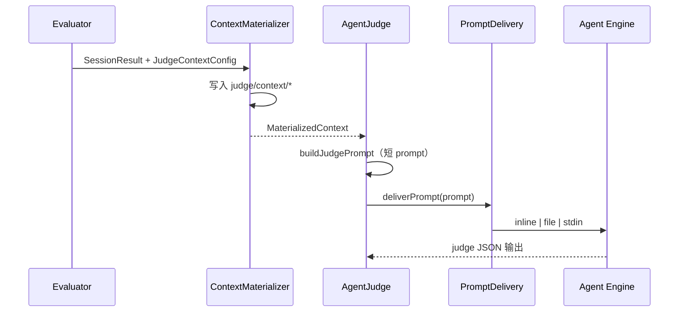

# SUP-0004: agent_judge 上下文传递与规模控制

语言：[English](../0004-agent-judge-context-delivery.md) | 中文

<!-- toc -->
- [SUP-0004: agent\_judge 上下文传递与规模控制](#sup-0004-agent_judge-上下文传递与规模控制)
  - [摘要](#摘要)
  - [动机](#动机)
    - [目标](#目标)
    - [非目标](#非目标)
  - [需求](#需求)
    - [必须有](#必须有)
    - [应该有](#应该有)
    - [最好有](#最好有)
  - [提案](#提案)
    - [用户场景速查](#用户场景速查)
      - [场景 1：长时仓库变更 Benchmark（`profile: minimal`）](#场景-1长时仓库变更-benchmarkprofile-minimal)
      - [场景 2：代码审查 Skill（`profile: standard`，默认）](#场景-2代码审查-skillprofile-standard默认)
    - [分字段模式说明](#分字段模式说明)
    - [作者体验：材料传递对用户无感](#作者体验材料传递对用户无感)
    - [Schema 形态](#schema-形态)
    - [Prompt 传递（所有 Agent）](#prompt-传递所有-agent)
    - [上下文物化（agent\_judge）](#上下文物化agent_judge)
    - [运行时行为](#运行时行为)
    - [注意事项/约束/说明](#注意事项约束说明)
    - [风险与缓解措施](#风险与缓解措施)
  - [设计细节](#设计细节)
    - [Schema 变更](#schema-变更)
    - [PromptDelivery](#promptdelivery)
    - [ContextMaterializer](#contextmaterializer)
    - [AgentJudge 改造](#agentjudge-改造)
    - [Evaluator 改造](#evaluator-改造)
    - [可观测性](#可观测性)
    - [文档与模板](#文档与模板)
  - [测试计划](#测试计划)
    - [单元测试](#单元测试)
    - [集成/E2E 测试](#集成e2e-测试)
    - [手工验证](#手工验证)
  - [缺点](#缺点)
  - [替代方案](#替代方案)
    - [方案 A：仅增加 `include_transcript: false`](#方案-a仅增加-include_transcript-false)
    - [方案 B：将受影响 Skill 整体改为 `script_judge`](#方案-b将受影响-skill-整体改为-script_judge)
    - [方案 C：代码硬截断 transcript、无配置](#方案-c代码硬截断-transcript无配置)
    - [方案 D：Judge 直连模型 API（不经 CLI）](#方案-djudge-直连模型-api不经-cli)
  - [所需基础设施](#所需基础设施)
  - [升级与迁移策略](#升级与迁移策略)
    - [Phase 1（P0）](#phase-1p0)
    - [Phase 2（P1）](#phase-2p1)
    - [Phase 3（P2）](#phase-3p2)
<!-- /toc -->

## 摘要

当前 skill-up 的 `agent_judge` 会将完整的 agent `transcript`、`final_message` 和 `workspace_diff` 内联拼进 judge prompt，再通过 `bash -c 'claude -p "<整段 prompt>"'` 传给 Claude Code 等 Agent Engine。长时任务、多工具调用和大体积 workspace diff 容易超过 OS `ARG_MAX` 上限，导致 `fork/exec /usr/bin/bash: argument list too long`。

本提案引入两层互补能力：

1. **Prompt 传递（所有 Agent）**：超大 prompt 自动改用文件或 stdin 传递，不再嵌入 argv。
2. **`judge.context`（仅 agent_judge）**：评测作者通过 `minimal` / `standard` profile 声明需要物化、引用、省略或截断哪些评审材料。

该设计与现有 `script_judge` 的「按路径传 artifact」思路对齐，同时保留 criteria + evidence JSON 的 LLM 评分形态。

## 动机

某长时 Skill 评测的生产 CI（某一高负载 case）在主 agent 执行完成后、judge 阶段失败：

```text
claude-code run failed: fork/exec /usr/bin/bash: argument list too long
agent_judge failed to parse agent output: no valid JSON found in agent output
```

根因分两层：

| 层级 | 机制                                                    | 影响                                                |
| ---- | ------------------------------------------------------- | --------------------------------------------------- |
| 传递 | `internal/agent/claude_code.go` → `buildClaudePrintCmd` | 整段 instruction 作为 shell 参数传入                |
| 内容 | `internal/judge/agent_judge.go` → `buildJudgePrompt`    | 内联 transcript JSON、workspace diff、final message |

长 case（`timeout_seconds: 3600`、`max_turns: 50`）下，仅 transcript 即可达数 MB。`agent_judge` 还会默认收集 workspace git diff（`judgeNeedsWorkspaceDiff` 对所有 `agent_judge` 返回 true），在 CI 检出完整应用仓库时体积同样可观。

仅增加 `include_transcript: false` 无法解决：

1. 与 transcript 无关的大体积 `workspace_diff`。
2. 主 agent case prompt 走同一 argv 传递路径的问题。
3. 未来共性场景：多轮评测、代码审查类 Skill、仓库级变更类 benchmark。
4. 上下文被截断或降级时缺乏可观测性。

### 目标

1. **消除 ARG_MAX 类失败**：agent 与 judge 在常见大规模评测负载下稳定启动。
2. **可配置 judge 上下文**：通过 `judge.context`（profile / attachments）控制材料范围；**criteria 写法保持不变**。
3. **默认安全**：新 eval 不再静默将 MB 级上下文内联进 argv。
4. **与 script_judge 对齐**：大材料落盘，prompt 只引用路径。
5. **可观测**：报告记录物化模式、体积、截断与 prompt 传递方式。
6. **兼容路径**：现有短 prompt eval 保持 inline 行为。

### 非目标

1. **不改变 `rule_based` 语义**：内存中的 transcript 断言逻辑不变。
2. **不将 `agent_judge` 整体替换为 `script_judge`**：保留 criteria + evidence 的 LLM 评分。
3. **MVP 不引入直连 HTTP/API judge**：仍通过现有 CLI adapter 运行 engine。
4. **MVP 不做 criteria 自动推断 profile**：profile 由作者显式声明；智能推荐后续迭代。
5. **不跨 case 共享 judge 上下文文件**：每个 case variant 使用独立 `judge/context/` 目录。

## 需求

### 必须有

| ID  | 需求                   | 验收标准                                                                            |
| --- | ---------------------- | ----------------------------------------------------------------------------------- |
| R1  | 大 prompt 传递         | 超阈值 prompt 使用 file/stdin；多 MB judge prompt 不再触发 `argument list too long` |
| R2  | `judge.context` schema | `JudgeConfig` 支持 `context` 及 profile、分字段模式                                 |
| R3  | 上下文物化             | `agent_judge` 按配置将材料写入 `judge/context/`                                     |
| R4  | 短 judge prompt        | 默认 `standard` profile 下 judge prompt 体积有界（路径引用，非内联 JSON）           |
| R5  | 自动降级               | `include` 模式受 `limits.max_bytes` 约束，超限自动降为 `file_ref`                   |
| R6  | 报告元数据             | `grading.json` / `result.json` 包含 `judge_context` manifest                        |
| R7  | 向后兼容               | 无 `judge.context` 的短 prompt eval 通过现有测试                                    |

### 应该有

| ID  | 需求               | 验收标准                                               |
| --- | ------------------ | ------------------------------------------------------ |
| S1  | Profile 预设       | `minimal`、`standard` 语义清晰且有文档                 |
| S2  | `attachments` 支持 | 作者可按路径附加业务产物（如 `diff-result.json`）      |
| S3  | 多 Engine 一致     | `codex`、`qodercli`、`qwen_code` 共用 `PromptDelivery` |
| S4  | 写作指南更新       | 中英文 eval 写作指南包含 `judge.context` 示例          |

### 最好有

| ID  | 需求                     | 验收标准                                                                            |
| --- | ------------------------ | ----------------------------------------------------------------------------------- |
| N1  | ARG_MAX 探测             | 可选的 exec 前体积检查与强制 file 模式日志                                          |
| N2  | `skill-up validate` 提示 | 已配置 `attachments` 但 profile 仍将大段 transcript 内联时，建议 `profile: minimal` |
| N3  | 共享物化包               | `script_judge` 与 `agent_judge` 复用同一 artifact 写入逻辑                          |

## 提案

### 用户场景速查

#### 场景 1：长时仓库变更 Benchmark（`profile: minimal`）

评测主要依据脚本产出与 diff 文件，而非对话历史：

```yaml
judge:
  type: agent_judge
  model: anthropic/claude-sonnet-4-6
  context:
    profile: minimal
    attachments:
      - path: evals/fixtures/artifacts/diff-result.json
        label: diff_result
  criteria:
    - "判定代码变更是否符合预期规则。"
    - "过滤临时目录后若结果一致，须引用可核验证据并通过。"
  pass_threshold: 1
```

要点：

- transcript 与 workspace diff 不进入 judge prompt。
- 业务证据通过 `attachments` 物化；**路径由框架自动写入 judge 材料表**，作者无需在 criteria 中声明文件路径。
- Judge prompt 保持短小；judge agent 根据 criteria 自行决定是否读取附件。

#### 场景 2：代码审查 Skill（`profile: standard`，默认）

```yaml
judge:
  type: agent_judge
  model: anthropic/claude-sonnet-4-6
  context:
    profile: standard
  criteria:
    - "识别真实 bug 并给出准确位置"
    - "未将正确代码误报为 bug"
```

生效行为：

- `transcript.json`、`workspace.diff`、`final_message.txt` 写入 `judge/context/`。
- 框架在 judge prompt 中**自动注入材料表**（路径、大小、模式）；作者 criteria **写法与今天相同**，无需提及文件名。
- judge agent 根据 criteria 自行打开需要的文件撰写 evidence。
- 需要更宽松截断或保留策略时，在 `standard` 下通过 `limits` 与分字段覆盖调整（无需额外 profile）。

### 分字段模式说明

`final_message`、`transcript`、`workspace_diff` 等字段均可单独指定投递方式（覆盖 profile 默认值）：

| 模式       | judge prompt 中           | 磁盘 artifact | 作用                                                                      |
| ---------- | ------------------------- | ------------- | ------------------------------------------------------------------------- |
| `include`  | 内联原文                  | 可选镜像      | 材料较短，希望 judge 直接看到全文                                         |
| `file_ref` | 仅路径/引用，不含全文     | 必写完整文件  | 材料较大，避免撑爆 prompt / argv（`standard` 对 transcript、diff 的默认） |
| `omit`     | 不出现                    | 不写          | 评审不需要该类材料（`minimal` 对 transcript、diff 的默认）                |
| `truncate` | 内联摘要 +「全文见 path」 | 写完整版      | prompt 里保留预览，全文在磁盘（`minimal` 对 `final_message` 的默认）      |

**兜底**：即使配置 `include`，单段超过 `limits.max_bytes` 时框架也会自动降为 `file_ref`。

`generated_files` 使用相近语义：`omit`（不要）、`index`（仅路径列表）、`include`（内联内容）。

### 作者体验：材料传递对用户无感

此前 `agent_judge` 将 transcript、diff 等**内联进 judge prompt**；作者只写 `criteria`，不必关心材料如何送达 judge。

本方案**只改传递机制，不改作者心智模型**：

1. 框架按 `profile` / 分字段配置物化材料，并在 judge 的 system prompt 中**自动注入材料表**（字段名、路径、大小、是否截断）。
2. 框架附带**固定评审指引**（例如：根据 criteria 按需读取材料表中的文件；JSON 回应中的 evidence 须可溯源到具体材料）。
3. 作者的 `criteria` **仍只描述「评什么」**，一般**不必**写「请读取 transcript.json」或 attachment 路径——`attachments` 配置后也会自动出现在材料表中。
4. judge agent 像主 agent 使用 Read 工具一样，**自行判断**需要打开哪些文件。

对作者而言：继续写 criteria → judge 评审；差异仅在实现层——材料不再塞进命令行，而由框架写好「菜单」供 judge 按需取用。

### Schema 形态

在 `JudgeConfig` 增加可选 `context`。case 级 `judge.context` 按现有 `MergeJudgeConfig` 优先级覆盖 eval 级配置。

```yaml
judge:
  type: agent_judge
  context:
    profile: standard          # minimal | standard
    final_message: include     # include | omit | truncate | file_ref
    transcript: file_ref       # include | omit | truncate | file_ref
    workspace_diff: file_ref   # include | omit | truncate | file_ref
    generated_files: index     # omit | index | include
    limits:
      max_bytes: 65536
      transcript_max_turns: 20
      workspace_diff_max_lines: 500
    attachments:
      - path: relative/or/absolute/path
        label: optional_label
```

省略分字段时的 profile 默认：

| Profile    | transcript | workspace_diff | final_message |
| ---------- | ---------- | -------------- | ------------- |
| `minimal`  | `omit`     | `omit`         | `truncate`    |
| `standard` | `file_ref` | `file_ref`     | `include`     |

完全省略 `judge.context` 时，evaluator 应用 `profile: standard`（相对今天隐式全量内联，属于行为变更）。

### Prompt 传递（所有 Agent）

新增 `internal/agent/prompt_delivery.go`：

| 模式     | 条件                            | 命令形态                                        |
| -------- | ------------------------------- | ----------------------------------------------- |
| `inline` | `len(instruction) <= threshold` | 现有 `claude ... 'instruction'`                 |
| `file`   | 超过阈值（默认回落）            | 写入 `$ARTIFACT_DIR/prompt.txt`，短命令引用路径 |
| `stdin`  | Engine 支持从 stdin 读 `-p`     | 管道传入 instruction                            |

常量：

- 默认 `SKILL_UP_PROMPT_INLINE_MAX_BYTES = 32768`
- 可通过环境变量覆盖

所有内置 engine（`claude_code`、`codex`、`qodercli`、`qwen_code`）的 `Run()` 统一经 `deliverPrompt(ctx, rt, opts, instruction)` 构造命令。

### 上下文物化（agent_judge）

新增 `internal/judge/context_materializer.go`：

输出目录：

```text
{outputDir}/{caseId}/{variant}/judge/context/
  manifest.json
  transcript.json
  workspace.diff
  final_message.txt
  attachments/
```

`buildJudgePrompt` 接收 `MaterializedContext`，输出：

1. **Criteria**（作者编写，不变）
2. **材料表**（框架自动生成：key、path、size、mode、是否截断）
3. **评审指引**（框架固定模板：根据 criteria 按需读取材料表中的文件；evidence 须可溯源）
4. **要求的 JSON 响应格式**

prompt 字符串中不再包含数 MB 的 JSON 块；作者无需在 criteria 中重复材料路径。

### 运行时行为



合并语义：

- eval 级 `judge.context` 为基础配置。
- case 级 `judge.context` 覆盖同名字段（与其他 judge 字段一致）。
- 未显式设置的字段继承 resolved profile。

### 注意事项/约束/说明

1. **Judge agent 必须能读文件**：`environment.type: none` 时，路径须对 engine 进程可读（绝对路径或 workspace 相对路径）。
2. **`include` 非无界**：超 `limits.max_bytes` 时框架自动降为 `file_ref`。
3. **`attachments.path`** 相对 Skill 目录解析，与 `script_path`、MCP `config_ref` 一致。
4. **行为变更**：省略 `judge.context` 不再表示「全部内联」，而表示 `profile: standard`。
5. **主 agent 同步受益**：即使作者未配置 `judge.context`，`PromptDelivery` 也会保护 case agent。

### 风险与缓解措施

| 风险                                         | 缓解                                                                     |
| -------------------------------------------- | ------------------------------------------------------------------------ |
| Judge LLM 忽略材料表、凭空打分               | 框架在 judge prompt 固定注入材料表与读文件指引；e2e 验证 evidence 可溯源 |
| `standard` 破坏依赖内联 transcript 的旧 eval | 文档说明迁移路径；`standard` + `transcript: include` 保留有限内联        |
| 未来 engine 不支持 file 模式                 | `PromptDelivery` 按 engine 能力矩阵回落                                  |
| CI 磁盘占用                                  | 上下文目录属于现有 artifact；可在 `rt.Close()` 时清理                    |
| attachment 路径穿越                          | 校验路径，拒绝逃出 skill 目录与 workspace 的 `..`                        |

## 设计细节

### Schema 变更

```go
type JudgeConfig struct {
    // 现有字段...
    Context *JudgeContextConfig `yaml:"context,omitempty"`
}

type JudgeContextConfig struct {
    Profile        string                   `yaml:"profile,omitempty"`
    FinalMessage   string                   `yaml:"final_message,omitempty"`
    Transcript     string                   `yaml:"transcript,omitempty"`
    WorkspaceDiff  string                   `yaml:"workspace_diff,omitempty"`
    GeneratedFiles string                   `yaml:"generated_files,omitempty"`
    Limits         *JudgeContextLimits      `yaml:"limits,omitempty"`
    Attachments    []JudgeContextAttachment `yaml:"attachments,omitempty"`
}

type JudgeContextLimits struct {
    MaxBytes              int `yaml:"max_bytes,omitempty"`
    TranscriptMaxTurns    int `yaml:"transcript_max_turns,omitempty"`
    WorkspaceDiffMaxLines int `yaml:"workspace_diff_max_lines,omitempty"`
}

type JudgeContextAttachment struct {
    Path  string `yaml:"path"`
    Label string `yaml:"label,omitempty"`
}
```

校验规则：

1. `profile` 若设置，必须为 `minimal`、`standard` 之一。
2. 分字段模式必须为 `include`、`omit`、`truncate`、`file_ref` 之一。
3. `attachments[].path` 非空。
4. `limits.max_bytes` 非负。

### PromptDelivery

位置：`internal/agent/prompt_delivery.go`

```go
func deliverPrompt(ctx context.Context, rt Runtime, opts ExecOptions, instruction string) (command string, err error)
```

职责：

1. 比较 `len(instruction)` 与 `inlineMaxBytes()`。
2. file 模式下写入 `filepath.Join(opts.ArtifactDir, "prompt.txt")`。
3. 返回不嵌入完整 instruction 的短 shell 命令。
4. 将 delivery 模式写入 context 供可观测性使用。

### ContextMaterializer

位置：`internal/judge/context_materializer.go`

```go
type MaterializedContext struct {
    Dir       string
    Manifest  ContextManifest
    Materials []ContextMaterial
}

func MaterializeJudgeContext(
    ctx context.Context,
    rt runtime.Runtime,
    cfg *config.JudgeContextConfig,
    in Input,
    artifactDir string,
) (*MaterializedContext, error)
```

职责：

1. 由 profile + 显式覆盖解析最终配置。
2. 将选中材料写入 `judge/context/`。
3. 将 `attachments` 复制到 `judge/context/attachments/`。
4. 生成含各字段字节数与截断标记的 `manifest.json`。

### AgentJudge 改造

`AgentJudge.Evaluate`：

1. 在 `buildJudgePrompt` 前调用 `MaterializeJudgeContext`。
2. 将 `MaterializedContext` 传入 `buildJudgePrompt`。
3. 利用 evaluator 已设置的 `judgeInput.ArtifactDir`，使 `PromptDelivery` 将 `prompt.txt` 写在 context 旁。

`buildJudgePrompt` 不再无条件将完整 transcript marshal 进 prompt 字符串。

### Evaluator 改造

1. `runJudgePhaseWithSpan`：judge 选择逻辑不变。
2. `newJudgeForCase`：将 resolved `JudgeContextConfig` 传入 `NewAgentJudge`，或由 `AgentJudge` 从 config 读取。
3. `prepareWorkspaceArtifacts`：仍将 workspace diff 写入 `SessionResult`；是否进入 prompt 由 materializer 决定。
4. `grading.json`：附加 materializer manifest 与 prompt delivery 元数据。

### 可观测性

在 judge grading 元数据中增加：

```json
{
  "judge_context": {
    "profile": "minimal",
    "materialized_dir": ".../judge/context",
    "manifest": {
      "transcript": { "mode": "omit", "bytes": 0 },
      "workspace_diff": { "mode": "omit", "bytes": 0 },
      "final_message": { "mode": "truncate", "bytes": 4096, "original_bytes": 12000 }
    },
    "prompt_delivery": "file",
    "prompt_bytes": 2048
  }
}
```

日志示例：

```text
level=INFO msg="judge context materialized" profile=minimal dir=...
level=INFO msg="prompt delivery" mode=file bytes=2048 threshold=32768
```

### 文档与模板

更新：

1. `docs/guide/writing-evals.md` — `judge.context` 与 profile。
2. `docs/zh/guide/writing-evals.md` — 中文镜像。
3. `skills/skill-upper/assets/eval.yaml.tmpl` — 补充 `agent_judge` context profile 说明。
4. `CHANGELOG.md` — 记录 `agent_judge` 默认行为变更。
5. 产品工作区设计文档可链接至本提案。

## 测试计划

### 单元测试

1. `internal/agent/prompt_delivery_test.go`
   - 31KB inline、33KB file 模式；
   - 结果 argv 长度低于安全边界；
   - 在 `ArtifactDir` 下生成 `prompt.txt`。

2. `internal/judge/context_materializer_test.go`
   - `minimal` / `standard` profile 解析；
   - `omit`、`file_ref`、`truncate`、`include` 自动降级；
   - attachment 复制与 manifest 生成。

3. `internal/judge/agent_judge_test.go`
   - 物化上下文的 `buildJudgePrompt` 不含完整 transcript JSON；
   - evaluate 路径写入 manifest 元数据。

4. `internal/config/validator_test.go`
   - 非法 profile/mode 被拒绝；
   - 合法 `judge.context` 可从 YAML 加载。

5. `internal/evaluator/evaluator_test.go`
   - 合成 2MB transcript：judge 阶段不构造多 MB argv；
   - grading 输出含 `judge_context`。

### 集成/E2E 测试

新增 fixture：

```text
e2e/testdata/agent-judge-large-context/
  SKILL.md
  evals/eval.yaml
  evals/cases/large-transcript.yaml
```

使用返回大 transcript 的 mock/custom engine。断言：

1. Judge 阶段不出现 `argument list too long`。
2. 存在 `judge/context/transcript.json`。
3. Judge prompt 文件或 inline prompt 低于阈值。

### 手工验证

```bash
make fmt
make verify
make test
go test -tags e2e -v ./e2e -run TestAgentJudge_LargeContext
```

使用 `context.profile: minimal` 重跑此前因 judge prompt 过大而失败的长时 CI case。

## 缺点

1. 默认 `standard` profile 会改变依赖隐式内联 transcript 的现有 `agent_judge` eval 行为（作者 criteria 写法可不变）。
2. 实现层须保证材料表与评审指引足够清晰，使 judge 在不改 criteria 的前提下仍能按需读文件。
3. 上下文物化带来额外磁盘 I/O（相对 agent 运行时间通常可忽略）。
4. 各 engine 的 file prompt 支持可能需在 `PromptDelivery` 中分别适配。

## 替代方案

### 方案 A：仅增加 `include_transcript: false`

改动最小，但不解决 `workspace_diff`、主 agent argv 限制与 attachment 扩展性。

### 方案 B：将受影响 Skill 整体改为 `script_judge`

对该 Skill 有效，但失去需要 LLM 语义评审的分支能力，且偏离「配套 judge Skill + `agent_judge`」的产品形态。

### 方案 C：代码硬截断 transcript、无配置

可降低失败率，但作者无法感知截断，且损害审计场景。

### 方案 D：Judge 直连模型 API（不经 CLI）

可避开 argv 限制，但违背 skill-up「真实 engine」定位，并重复鉴权路径。

## 所需基础设施

无需新增外部服务。

实现涉及 `internal/agent`、`internal/judge`、`internal/evaluator`、`internal/config` 的 Go 改动、测试与文档。CI runner 除消费更小的 judge argv 外无需变更。

## 升级与迁移策略

分阶段发布：

### Phase 1（P0）

- `claude_code` 接入 `PromptDelivery`
- `judge.context` 支持 `minimal` 与 `standard` profile
- `judge_context` 报告元数据
- 长时 benchmark 类 eval 采用 `profile: minimal` 作为参考配置

### Phase 2（P1）

- `attachments`、细粒度 limits、多 engine 一致
- 写作指南与 skill-upper 模板更新
- `standard` profile 下读文件与 `limits` 覆盖的 e2e 覆盖

### Phase 3（P2）

- 与 `script_judge` 共享物化包
- `skill-up validate` 推荐提示

向后兼容：

1. 短 prompt 继续使用 inline 传递。
2. 需要旧式内联 transcript 的 eval 设置 `context.transcript: include`（受 `limits.max_bytes` 约束）。
3. 在 CHANGELOG 中说明默认从隐式内联迁移到 `standard` 文件引用行为。

文档应明确：

- SUP-0004 引入 `judge.context` 与 `PromptDelivery`；
- `agent_judge` 默认物化上下文，不再将 MB 级材料内联进 argv；
- 长时 benchmark 在配置了 `attachments` 或仅需脚本/文件产物时，宜使用 `profile: minimal`。
